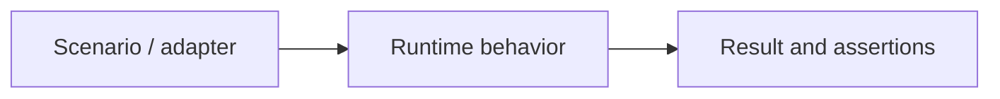

What observable behavior changes, and why?

Replace the diagram labels with this change's actual path. Include a before/after
example for behavior changes; remove irrelevant sections for small changes.

- Validation and the plausible regression caught:
- Deliberate negative control or mutation (when practical):
- API/result compatibility and changelog:
- External contracts still unverified:
