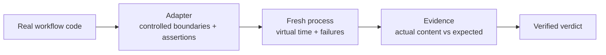

# workflow-sim

Test an asynchronous Python workflow against virtual time, retries and failures,
then inspect what it actually wrote or delivered. Each run uses a fresh process.

**Internal alpha · CPython 3.12 · Linux and macOS.** The package is privately hosted
on [Karthik's GitHub](https://github.com/karthiksraju/workflow-sim). Licensing and
public distribution are pending. Do not redistribute it yet.

This is a testing library. You supply the real workflow code, controlled external
boundaries and assertions about observable state. A passing simulation says those
assertions held in that model; it does not certify the live system.

## The path from workflow to verdict



The runtime controls execution; your adapter supplies the external contracts and
business assertions. [See the architecture](https://github.com/karthiksraju/workflow-sim/blob/main/docs/architecture.md).

See the [six domain examples](docs/examples.md), [tester guide](docs/try-the-alpha.md),
and [independent confidence checks](docs/confidence.md).

The alpha 4 candidate closes unaccounted Celery/Kombu publication paths and adds
calendar origins. [Migration and verification](docs/alpha4.md) explain which
previous PASS results need rerunning. Alpha 3 remains available for reproduction;
its missed-publication results do not establish the corrected checks.

## Try the installed package

Use a Python 3.12 virtual environment. Repository access is required:

```sh
python3.12 -m venv .venv
. .venv/bin/activate
python -m pip install 'git+ssh://git@github.com/karthiksraju/workflow-sim.git@v0.1.0a4'
workflow-sim workflow_sim.examples.retry:build --duration 10 --output result.json
```

The example commits a delivery, loses its acknowledgement, then retries five
virtual seconds later. Its checks require one durable delivery with the exact
payload and two attempts. It should return `PASS` without waiting five seconds.

Try the deliberate bug:

```sh
printf '{"broken": true}\n' > broken.json
workflow-sim workflow_sim.examples.retry:build --inputs broken.json --duration 10
```

This returns `ASSERTION_FAILED` (exit 1), with two deliveries in `actual` and one
in `expected`. A Celery example is included too:

```sh
workflow-sim workflow_sim.examples.celery_retry:build --duration 10
```

## Connect a workflow

Create `my_adapter.py` in your project:

```python
import asyncio


def build(ctx):
    stored = []

    async def process():
        await asyncio.sleep(120)
        stored.append({"job": "42", "status": "complete"})

    ctx.at(0, "process-job", process)
    ctx.expect("stored result", lambda: stored,
               [{"job": "42", "status": "complete"}])
```

Run it from that project directory:

```python
from workflow_sim import run

result = run("my_adapter:build", duration=180, seed=42)
assert result["outcome"] == "PASS", result
```

Replace `process` with your application entrypoint and `stored` with a boundary
fake that records real writes. Import application code inside `build` when it
needs patched time or boundaries. Seed realistic existing state, including old
completion markers or a previous failed attempt. Assert final content and absence
of duplicate effects. See [adapter authoring](https://github.com/karthiksraju/workflow-sim/blob/main/docs/adapters.md).

## What a result means

| Outcome | Meaning |
| --- | --- |
| `PASS` | Work completed within the horizon; every registered check matched. |
| `ASSERTION_FAILED` | Execution completed but at least one value differed. |
| `INCOMPLETE` | Timeout, budget, outstanding work, dropped timers or no checks. |
| `UNSUPPORTED` | A blocked boundary or unsupported runtime feature was encountered. |
| `HARNESS_ERROR` | Adapter exception, task/callback failure or invalid worker result. |

The result contains actual/expected values, a causal event ledger, an execution
report, content hashes and runtime provenance. No results or telemetry are uploaded.
CLI exit codes are 0, 1, 2, 3 and 4 respectively; invalid input exits 4.

## Boundaries

- Trusted Python adapters only. Process isolation and socket/subprocess guards are
  **not a security sandbox**. Run without production credentials or mounted
  production data. Filesystem writes and C extensions are not isolated.
- The scheduler models asyncio timers, supported thread-pool ownership and a
  Celery task heap. It does not simulate a real broker, database transaction engine,
  OS scheduler, multiple machines, or every possible interleaving.
- CPython 3.12 is deliberate: crash fencing relies on its monitoring and thread-pool
  internals. Windows, alternate loops such as uvloop, and Python 3.13+ are not supported.
- The default wall timeout is 30 seconds. The runtime does not impose a memory or
  filesystem quota. A timeout cannot undo an external effect already started.
- An assertion can be trivial or an adapter can be wrong. The library cannot infer
  the right business invariant; negative controls and real contract fixtures matter.

[API and evidence contract](https://github.com/karthiksraju/workflow-sim/blob/main/docs/contracts.md) · [Architecture](https://github.com/karthiksraju/workflow-sim/blob/main/docs/adr/0001-alpha-boundary.md) ·
[Contributing](https://github.com/karthiksraju/workflow-sim/blob/main/CONTRIBUTING.md) · [Release process](https://github.com/karthiksraju/workflow-sim/blob/main/docs/releases.md) ·
[Validation and remaining limits](https://github.com/karthiksraju/workflow-sim/blob/main/docs/validation.md) · [Security](https://github.com/karthiksraju/workflow-sim/blob/main/SECURITY.md)
