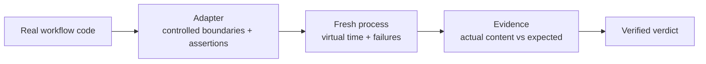

# workflow-sim

Run Python async/Celery workflows with virtual time, retries and failures. Check
what they wrote or delivered, including duplicate effects and unfinished work.
Each run uses a fresh process.

**Internal alpha · CPython 3.12 · Linux and macOS.** Repository access is required.
Public licensing and distribution are pending. Do not redistribute the alpha yet.

You supply real workflow code, models of its external systems, and assertions.
`PASS` means those assertions held in the modeled execution. It does not certify
the live system.

## The path from workflow to verdict



## Try the installed package

Install [uv](https://docs.astral.sh/uv/getting-started/installation/), then create a
trial project. uv obtains a compatible Python and manages the environment:

```sh
uv init --bare --python '>=3.12,<3.13' workflow-sim-trial
cd workflow-sim-trial
uv add 'workflow-sim @ git+ssh://git@github.com/KarthikRaju391/workflow-sim.git@v0.1.0a4'
uv run workflow-sim workflow_sim.examples.retry:build --duration 10 --output result.json
```

In an existing uv project, use the same `uv add` command. Its Python requirement
must fit this alpha's `>=3.12,<3.13` range. Commit the application's `uv.lock` to
retain its resolved dependencies.

The receiver commits a delivery but loses its acknowledgement. The workflow
retries five virtual seconds later. The result should be `PASS`: one delivery of
`invoice-42` for amount `1200`, after two attempts.

Enable the duplicate-delivery bug:

```sh
printf '{"broken": true}\n' > broken.json
uv run workflow-sim workflow_sim.examples.retry:build --inputs broken.json --duration 10
```

This returns `ASSERTION_FAILED` (exit 1): two deliveries where one was expected.
Read the `actual` and `expected` values in the result.

## Connect a workflow

An adapter calls your application and registers final-state checks:

```python
import asyncio


def build(ctx):
    stored = []

    async def process():
        await asyncio.sleep(120)
        stored.append({"job": "42", "status": "complete"})

    ctx.at(0, "process-job", process)
    ctx.expect("stored result", lambda: stored,
               [{"job": "42", "status": "complete"}])
```

Save this as `my_adapter.py`, then run from that directory:

```sh
uv run workflow-sim my_adapter:build --duration 180
```

Replace `process` with your application's entrypoint and `stored` with a model
of its storage boundary. The [tester guide](docs/try-the-alpha.md) walks through
choosing a failure, seeding existing state and testing the assertion with a bug.
The [example catalog](docs/examples.md) covers billing, fulfillment, ingestion,
documents, monitoring and meetings. Each has a corrected and broken version.

## Read the result

| Outcome | Meaning |
| --- | --- |
| `PASS` | Work completed within the horizon; every registered check matched. |
| `ASSERTION_FAILED` | Execution completed but at least one value differed. |
| `INCOMPLETE` | Timeout, budget, outstanding work, dropped timers or no checks. |
| `UNSUPPORTED` | A blocked boundary or unsupported runtime feature was encountered. |
| `HARNESS_ERROR` | Adapter exception, task/callback failure or invalid worker result. |

Results include checks, a causal event ledger, execution health and provenance.
[Contracts](docs/contracts.md) define verdict precedence, CLI exit codes and hashes.
[Alpha 4 migration](docs/alpha4.md) covers calendar origins and previously
unaccounted publication paths whose old PASS results need rerunning.

## Limits

Use trusted adapters in a disposable environment without production credentials.
Process cleanup and network guards are not a security sandbox; files, environment
variables and native extensions remain accessible. See [security](SECURITY.md).

The scheduler models supported asyncio, thread-pool and Celery behavior. It does
not reproduce a live broker, database or every thread interleaving. The default
wall timeout is 30 seconds; it cannot undo an external effect already started.
There is no memory or filesystem quota. Assertions and boundary models need their
own validation.

[Architecture](docs/architecture.md) · [Evidence and gaps](docs/validation.md) ·
[Contributing](CONTRIBUTING.md) · [Release process](docs/releases.md)
