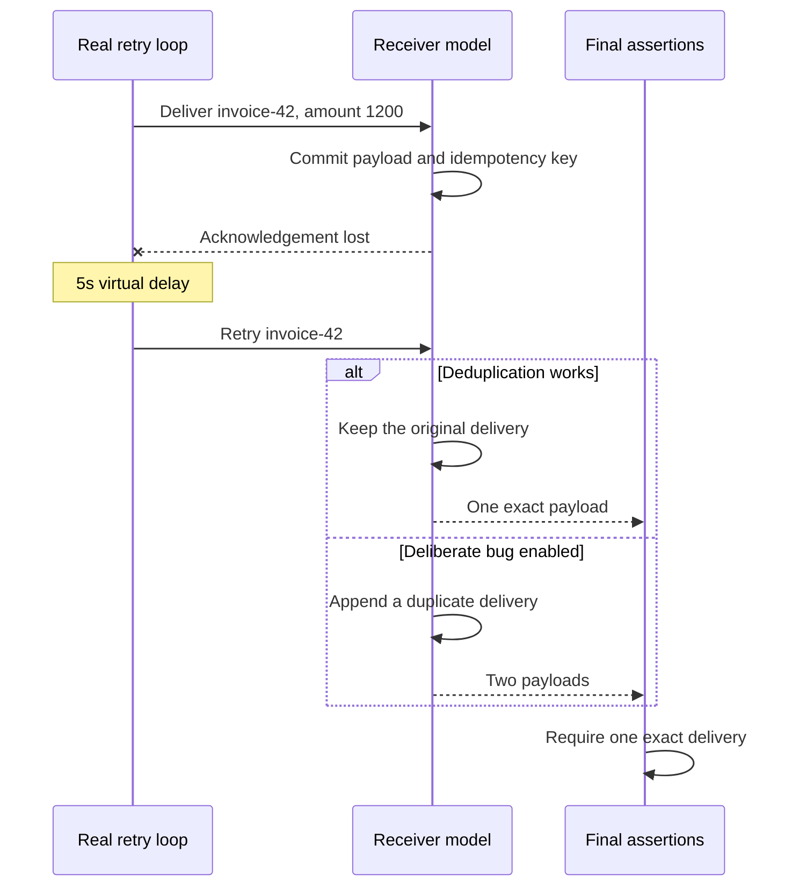

# Authoring an adapter

Choose an observable effect: a stored row, delivered message or completion marker.
Call the application's real entrypoint and model its external services and storage.
Keep the decision logic under test running.

1. Seed realistic initial state: old derived data, prior attempts and completion
   markers. A replacement test starting from an empty database misses stale data.
2. Model only the external contract needed by the scenario. State its provenance:
   documented schema, producer implementation, or sanitized captured response.
3. Schedule failures and changes at explicit offsets. Assert the stored payload,
   final markers and absence of duplicate effects. A call count alone is rarely enough.
4. Run a negative control. Break the intended property and show the same assertions
   reject it. Keep both the case and the evidence of why it fails.
5. Repeat with the same seed, then vary relevant ordering, delays and failure points.
   A larger seed count without new behaviors does not necessarily improve coverage.

The retry example models an atomic idempotency-key write followed by a lost
acknowledgement. This is a synthetic receiver contract. The Celery example uses
the real producer/task tracer to check JSON payloads and retry counts.

Use a disposable environment without production credentials. Adapters can read
files and environment variables; see [security](../SECURITY.md).

## Why the retry example catches a real failure shape



The failure starts after the first durable effect. Testing only a timeout before
any write would not expose this duplicate-delivery bug. The assertion inspects
persisted content, not just whether retry code was called.

## Existing Celery applications

Schedule the application's own registered tasks through `.delay` or `.apply_async`
inside `ctx.at`; calling the task body directly skips producer/retry behavior.
For example, with a real application task and a modeled gateway:

```python
from my_app import tasks


def build(ctx):
    gateway = FakeGateway()  # implement the provider contract for this scenario
    tasks.gateway = gateway  # patch the symbol where the application uses it
    ctx.at(0, "refund", lambda: tasks.refund.delay("order-42", 1200))
    ctx.expect("refund payload", lambda: gateway.refunds,
               [{"order_id": "order-42", "amount": 1200}])
```

`FakeGateway` and the expected payload are application-specific; seed existing
provider/storage state and implement commit/acknowledgement semantics explicitly.
The runnable [Celery retry example](examples.md#celery-retry-preserve-the-queued-payload)
shows the producer path and a negative control without application dependencies.

The simulator intercepts supported Celery task publication and result operations;
these paths do not connect to the configured broker/backend URLs. This does not
cover arbitrary import-time application IO or custom transports. Celery may still
load the configured backend/transport's Python client. Keep the application's
required client dependencies installed (for example `redis`); a missing client
can produce `HARNESS_ERROR` even when business assertions match. No real broker
or worker is needed for the modeled run. Live delivery and provider contracts
need separate integration checks. See [supported boundaries](contracts.md).

## Existing applications and advanced bindings

The experimental `Engine` accepts `clock_seam`, `asyncio_bridge`, and `log_module`.
They are explicit application integration points:

- Clock seam: `install(provider)` / `uninstall()`; provider has now/time/monotonic/sleep.
- Async bridge: `run_coro_sync(coro)` and `_ensure_background_loop()`;
  an existing loop may be exposed as `_LOOP`. Imported `run_coro_sync` aliases are
  rebound while the engine is installed, then restored.
- Structured logger: `log_event(event_id, msg='', level='info', data=None,
  exc_info=False)`. The ledger captures aliases and restores them at uninstall;
  captured stale wrappers delegate to the original logger after uninstall.

These experimental bindings preserve the first consumer's bridge/log conventions.
Keep the compatibility modules in the application; the library must not import it.

The meeting consumer owns provider models, YAML scenarios, production entrypoints,
contract captures and business assertions. They do not belong in the shared package.
Every library upgrade must preserve its healthy regressions **and** declared
counterexamples. Do not turn a known failing product case into a green test by
weakening assertions during extraction.

Propose a shared abstraction with two concrete workflows and a failing case that
the current boundary cannot express. Keep workflow-specific helpers in the adapter.
