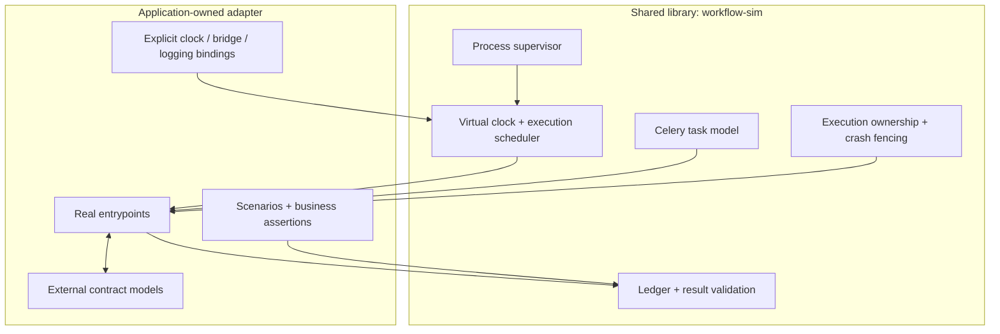

# 0001 — Extract the tested execution runtime and retain domain adapters

Status: accepted for alpha implementation.

The simulator must run real application control flow with controlled external
responses and produce evidence that distinguishes application failures from
invalid input, unsupported execution and incomplete runs.

The reusable runtime owns virtual time, scheduling, Celery emulation, execution
containment and immutable evidence. Workflow adapters own application imports,
fake services, inputs, checkpoints and expected content/state. No meeting schema,
customer history, credentials or provider-specific fake belongs in the package.

The normal public API starts a new process per run. Global clock patches and
abandoned threads never belong in a caller's process. Python code supplied by an
adapter is trusted; process isolation is lifecycle containment, not a security
sandbox. Default network rejection is a guard against accidental calls, not an
OS security guarantee.

Keep the existing scheduler and crash semantics. Replace application imports
with explicit runtime bindings. Celery remains a declared alpha dependency:
separating a second queue backend is deferred until a concrete consumer needs it.
No generic plugin discovery or arbitrary YAML code execution is introduced.

The initial alpha supported CPython 3.12 and POSIX Linux/macOS. Current source
extends this to standard GIL-enabled CPython 3.13 and 3.14, with conformance CI
required on every supported minor and platform. Other runtimes must fail explicitly.
Validate the extracted implementation with inherited engine probes, installed-wheel
tests, a small independent workflow and the meeting adapter. Product bugs must
remain product failures; extracting a library is not a reason to mute them.

Version the public adapter and result contracts independently of private engine
internals. Preserve input/code/dependency identity in every result. No stable
1.0 API or universal determinism claim is made for this alpha.

## Boundary map

This boundary is justified by the existing meeting consumer and the independent
retry/Celery examples. New application-specific models stay with the adapter;
shared runtime changes need an observable case that the current boundary cannot
express. See [the execution architecture](../architecture.md) for process lifetime
and evidence flow.
