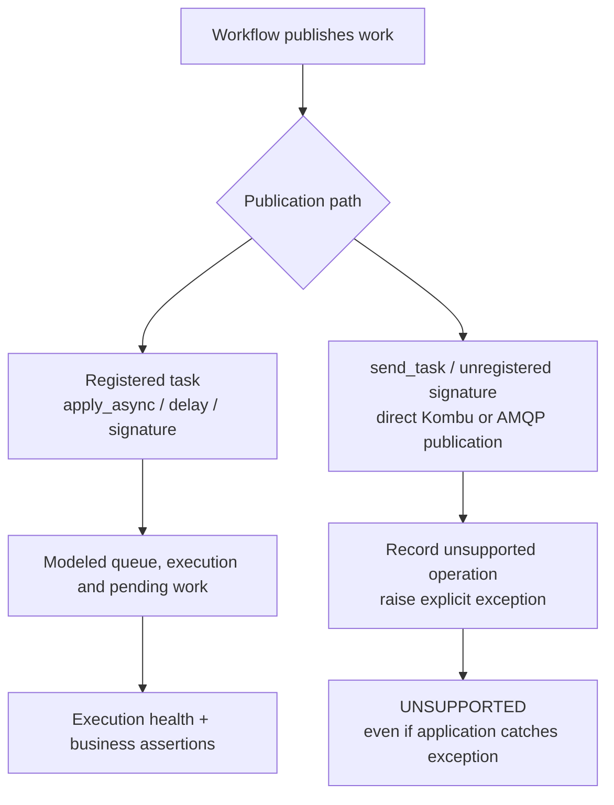

# Alpha 4: publication accounting and calendar time

Alpha 4 closes a silent publication gap and adds a configurable clock origin.
The full queue-independent redesign remains separate.



## Migration

Use registered task objects/signatures through the supported task API, or replace
an external publication boundary in your adapter. `send_task` is rejected even
when the name is registered: this release does not implement that API's routing
or broker behavior. The guard also covers Kombu producer publication and the
virtual/AMQP channel publication methods. It is not a security sandbox and does
not certify arbitrary custom transport implementations or method overrides.

Rerun scenarios using previously unaccounted publication paths. A former PASS may
now become UNSUPPORTED; do not relabel archived evidence. Exact business-content
assertions and negative controls remain essential.

For calendar-sensitive workflows:

```python
from workflow_sim import run

result = run("my_workflow:build", duration=600,
             start_at="2026-01-15T15:30:00+05:30")
# Verified configuration records 2026-01-15T10:00:00+00:00.
```

```sh
workflow-sim my_workflow:build --duration 600 --start-at 2026-01-15T10:00:00Z
```

Result schema remains 1. `start_at` is an optional configuration field introduced
in alpha 4; alpha 3 does not accept the new request option. Without the option,
the request and configuration shape, default clock origin and supported task
semantics remain unchanged. Store package version alongside evidence. Consumers
that enumerate configuration fields must allow `start_at` when opting in.

## Verification scope

The local acceptance harness exercises publication during setup, execution and
assertion evaluation; caught exceptions; exact delivered content; parent patch
isolation/restoration; timezone normalization; microsecond timers; absolute ETAs;
configuration tampering; and stale CLI output removal. Its synthetic fixtures use
the installed Celery/Kombu producer APIs. The harness stays outside the library.

The unchanged alpha 3 wheel fails 18 publication regression checks. This supplies
an old-code negative control, not merely a green test of the new implementation.
The [verification report](validation/alpha4.md) records installed-wheel, corpus,
mutation, real-worker and pinned consumer comparison results.

The independent corpus still has 36 implemented reference business workflows out
of 240 cases. Executing all 240 input timelines does not validate the remaining
204 business contracts. This release adds no new provider, broker or backend claim.
