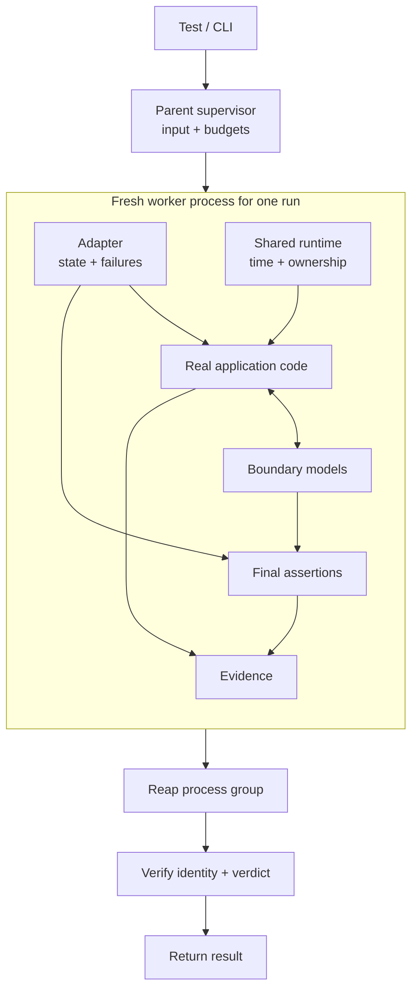
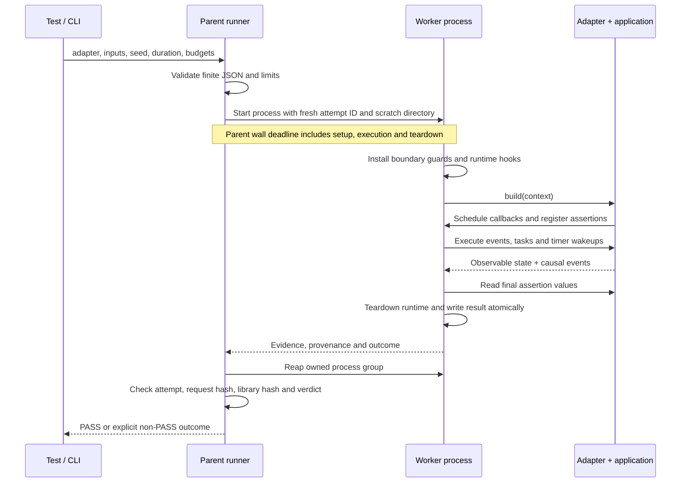
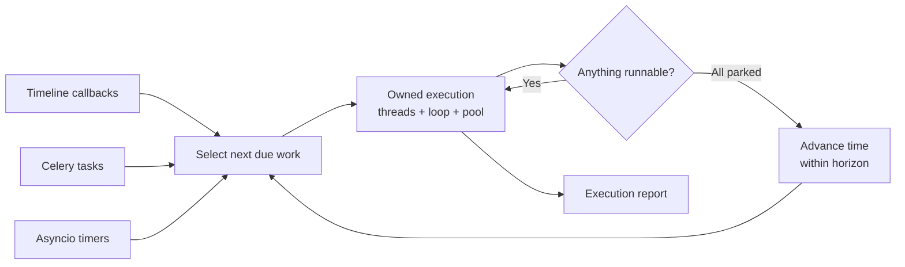
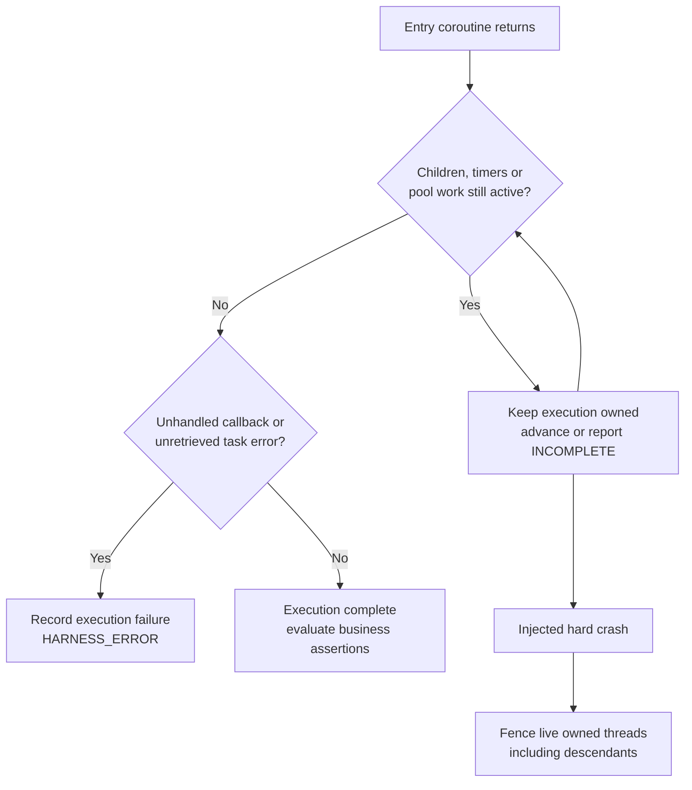
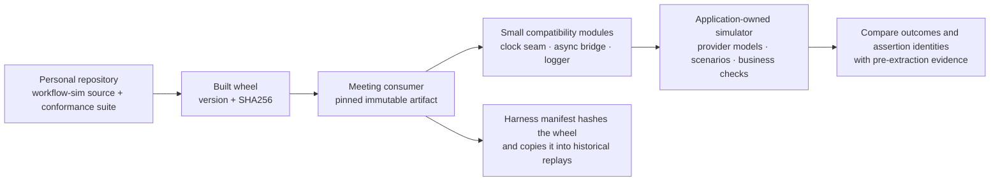

# Architecture

The library owns **when work runs and what evidence it produces**. The adapter
owns **what the application does, how external systems respond, and what correct
behavior means**. Both execute in a disposable worker process.

## Where each responsibility lives

The parent never installs clock or Celery patches. The worker does. Normal runs,
failed runs and interrupted runs all go through parent-owned process cleanup.
This separates simulator state between tests; it does not restrict a trusted
adapter's filesystem access or turn Python into a security sandbox.

## One run, from request to evidence

If a worker times out, exits abnormally or publishes invalid evidence, the parent
returns a non-PASS result. A worker's claim of PASS is insufficient on its own.

## Inside the scheduler

At equal instants, timeline items precede queued Celery work, which precedes timer
wakeups. Items retain insertion order; equal-deadline loops wake in park order.
The scheduler waits for owned thread-pool work before advancing time. Hard crash
fencing and graceful cancellation are distinct behaviors, covered by separate tests.

This is one controlled scheduling model. It does not explore every possible
interleaving or reproduce a real broker's distribution and acknowledgement behavior.

## Completion belongs to the whole execution

The runtime retains created tasks/futures through evidence collection so garbage
collection cannot hide an unobserved exception. CPython 3.12's exception-retrieval
flag distinguishes handled errors from unhandled ones; application loop handlers
still run. Final health is refreshed after assertions. Celery retries preserve
continuation metadata at signature production, while the simulator owns exactly
one continuation dispatch. Each delivery decodes the saved serialized message.

[Alpha 2 corrections](alpha2.md) map the adversarial findings to their regression
checks and describe changed evidence semantics.

## Extraction and the first consumer

The wheel is a generated dependency artifact, not a second editable implementation.
Private-alpha vendoring avoids distributing personal GitHub credentials to the
application's CI and keeps historical proof runs bound to their executed bytes.
A loader refuses a modified wheel or an already-imported package from another source.

The meeting adapter stays in its application repository. The library includes six domain reference workflows and two
small introductory examples, so a new workflow can use it without meeting code,
customer fixtures, application configuration or test dependencies.

## Code map and extension points

| Concern | Source | Change it when… |
| --- | --- | --- |
| Process lifecycle and limits | [runner.py](../src/workflow_sim/runner.py), [_worker.py](../src/workflow_sim/_worker.py) | Ownership or cleanup behavior changes. |
| Adapter authoring | [context.py](../src/workflow_sim/context.py) | Two real consumers need a shared operation. |
| Verdict and result validation | [contracts.py](../src/workflow_sim/contracts.py) | Evidence rules change; consider a schema version. |
| Virtual time and execution | [clock.py](../src/workflow_sim/clock.py), [engine.py](../src/workflow_sim/engine.py) | An independent timing/ownership probe fails. |
| Celery semantics | [celery_driver.py](../src/workflow_sim/celery_driver.py) | A supported producer/task behavior is missing. |
| Evidence and identity | [ledger.py](../src/workflow_sim/ledger.py), [provenance.py](../src/workflow_sim/provenance.py) | Records omit or misattribute an observable fact. |
| Application boundaries | Your adapter repository | A provider/storage contract or workflow changes. |

Stable-for-this-alpha entrypoints are `run()` and the documented context methods.
The advanced engine and application bindings remain experimental. A new backend,
plugin registry or generalized storage model needs concrete consumers before it
belongs here. See [the boundary decision](adr/0001-alpha-boundary.md) and
[the exact API contract](contracts.md).

## How changes earn release confidence

The [validation architecture](confidence.md) combines independent arithmetic and
generated lifecycle models, ordinary asyncio, actual Redis/prefork Celery workers,
and targeted mutations. Both platform jobs and the confidence job gate release
promotion. Keep these tools in development dependencies; consumers only install
the execution runtime and its bounded runtime dependencies.
