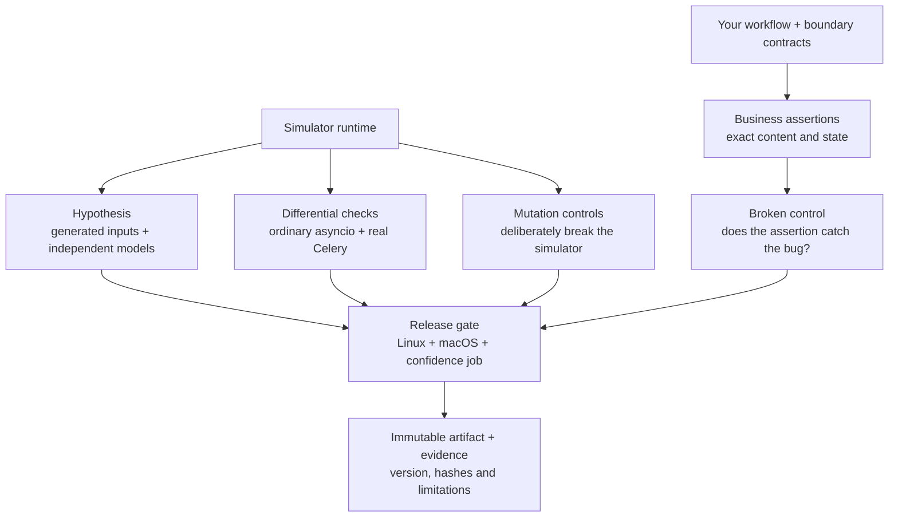
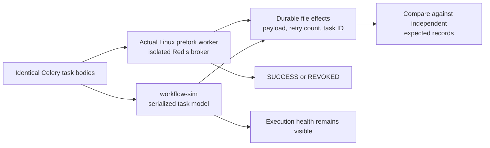

# How we test the simulator

We check the simulator against independent models, ordinary asyncio, real Celery
workers and deliberately introduced defects. Each checks a bounded set of behavior.



## What each layer establishes

| Check | Evidence | Remaining limit |
| --- | --- | --- |
| Six domain examples | Corrected versions meet exact state/content assertions; six deliberate bugs fail them. | Synthetic reference workflows; only the meeting consumer has separate application integration evidence. |
| Generated async programs | Up to 35 Hypothesis examples compare the same coroutine/thread-pool workload with ordinary asyncio and independently computed results. | Bounded input space; compares observable results, not unconstrained thread ordering. |
| Generated child lifecycles | Up to 50 examples vary completion time, cancellation, errors and run horizon against an independent outcome model. | This supplements the existing clock/stateful suite; it is not full schedule exploration. |
| Real Celery contracts | Four shared task programs run in Linux prefork workers with Redis and in the simulator. Compare durable effects, retry identity, payloads, redelivery flags and expiry. | Celery 5.6.3, JSON, one worker child, the recorded Redis version; no RabbitMQ, database or provider certification. |
| Targeted runtime mutations | Six deliberately introduced runtime defects must cause assertion failures in their functional regressions after a clean baseline. | A curated campaign, not a whole-codebase mutation score. |
| Installed package checks | Linux/macOS suites, wheel/sdist metadata, clean minimal installation and installed examples. | CPython 3.12 only. Dependency bounds are broader than the frozen tested set. |

Hypothesis generates and minimizes failing **test inputs**. The library does not
promise to minimize arbitrary user scenarios or explore all schedules. See
[Hypothesis stateful testing](https://hypothesis.readthedocs.io/en/latest/stateful.html).

## Real worker comparison



The four cases are retry through a chain, duplicate JSON messages, worker loss
after a durable effect, and expiry before execution. The worker-loss reference
really exits a prefork child with `os._exit`; Celery redelivers its unacknowledged
message. The simulator injects its modeled crash at the corresponding parked
point. Both must deliver the original unmodified payload on retry. The simulator
reports `HARNESS_ERROR` for the injected crash even when the business checks match.
That distinction prevents a recovery test from hiding execution health.

These tests use actual workers, not eager mode. Celery's own
[testing guidance](https://docs.celeryq.dev/en/stable/userguide/testing.html)
explains why eager mode differs from worker execution. The shared task bodies are
in [celery_contracts.py](../confidence/celery_contracts.py). File writes represent
durable effects; they do not validate transactional database semantics.

## Does our test suite catch simulator defects?

The mutation gate temporarily introduces each fault in a disposable source copy
installed in its own interpreter. Public runner subprocesses use that installation.
The original checkout stays unchanged.

| Deliberate defect | Observable regression required |
| --- | --- |
| Forget asynchronous descendants | Outstanding work cannot be reported as complete. |
| Hide unretrieved task errors | Matching business values cannot turn execution failure into PASS. |
| Leave completed task limits armed | Finished work must not leave deadline events pending. |
| Reuse mutated task arguments | Duplicate delivery must receive the original serialized payload. |
| Forget caught unsupported operations | Catching an exception must not hide unsupported behavior. |
| Preserve an old CLI result after invalid arguments | A previous PASS file must be removed. |

A baseline must pass first. Import/collection errors, timeouts and syntax errors
do not count as successful detections. Reports include source hashes, the precise
replacement, selected regression, JUnit output and assertion failure logs.

## Reproduce the evidence

After the [contributor setup](../CONTRIBUTING.md):

```sh
uv run --locked python scripts/check_examples.py --output /tmp/workflow-examples
uv run --locked pytest -q tests/test_generated_execution.py
uv run --locked python scripts/check_mutations.py --output /tmp/workflow-mutations
```

Run the worker comparison on Linux with a disposable Redis instance:

```sh
CONTRACT_BROKER=redis://localhost:6379/0 \
  uv run --locked python scripts/check_celery_contracts.py --output /tmp/workflow-celery
```

Use a fresh Redis service, as CI does. The script uses a unique queue and never
flushes Redis, but writes task results. The confidence CI job retains full reports
and worker logs. Release promotion requires both platform jobs and this job to
succeed on the tagged commit; its evidence archives are included in SHA256SUMS.

## What we can responsibly claim

Report which behaviors and contracts were checked, with their revisions and
fixtures. A scenario count alone does not establish coverage.

A new adapter needs a sourced boundary fixture, a broken control and an integration
check for the modeled contract. These gates do not establish production safety,
exhaustive concurrency coverage, model answer quality, provider compatibility or
superiority to another simulator. Current results are in the
[validation index](validation.md).
