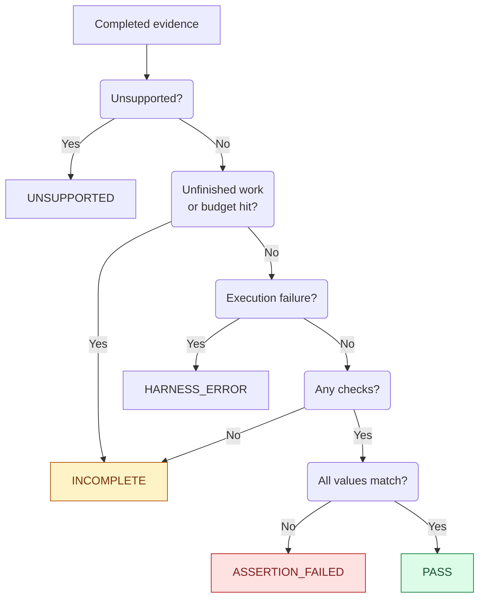

# Alpha contracts

## Supported API

`workflow_sim.run(adapter, *, inputs=None, duration=60, seed=0,
max_steps=100_000, wall_timeout=30, project_dir=None, start_at=None)` returns a JSON-compatible
dict. `adapter` is an explicit `module:function`, imported in a new child process.
The factory receives one context, configures it, and returns `None`.

Caller validation raises `ValueError`; an unsupported platform raises
`RuntimeError`. A failed worker produces a non-PASS result. Each call gets a new
scratch directory and process group; the supervisor kills/reaps its process group
on success, timeout, failure or interruption. A deliberately detached descendant
can escape this mechanism. Adapters are trusted code, not hostile plugins.

`inputs` must be an object containing finite JSON values. No implicit coercion of
tuples, integer keys or NaN. The request is limited to 1 MB, the result to 8 MB,
and combined worker output to 256 KB. The default wall deadline covers imports,
setup, callbacks, assertions, teardown and output. It is configurable up to one
hour. A seed is an unsigned 64-bit integer; step budgets range from 1 to 1,000,000.
The default virtual start is `2099-01-01T00:00:00Z`; duration is 0 through 366 days.
Set `start_at="2026-01-15T10:00:00Z"` (CLI: `--start-at`) for calendar-sensitive
workflows. Supply an ISO timestamp with seconds, an explicit `Z` or numeric
`±HH:MM` timezone, and at most six fractional digits. It is normalized to UTC;
naive dates, invalid timestamps and an origin-plus-duration overflow raise
`ValueError` before executing the adapter. Relative scheduling still starts at
zero. Wall-clock reads, asyncio timers and absolute Celery ETAs share this origin.
Omitting it preserves the old default request and configuration shape.

`project_dir` defaults to the caller's directory and supplies Python import
resolution. The child's current directory is temporary. Dependencies must be
installed in the caller's environment; caller `PYTHONPATH` is ignored. Other
non-Python environment variables are inherited, including credentials if present.

## Context

- `at(seconds, label, callback)` schedules a synchronous or async callback relative
  to start. Nonnegative finite offsets and unique nonempty labels are required.
- `expect(name, actual_callable, expected_json)` snapshots the expected value now
  and reads actual final state after the horizon. Names must be unique. Comparison
  uses canonical JSON, including types: `true` differs from `1`.
- `record(event, **json_data)` records an immutable, causally attributed event.
- `inputs`, `project_dir`, `scratch_dir` provide scenario inputs and paths.
- `engine` exposes the experimental kernel for advanced adapters. Its API has no
  compatibility promise during alpha; ordinary adapters should use the methods above.

No checks means INCOMPLETE. Outstanding future tasks/items, in-flight executions,
dropped timers or exhausted budgets also prevent PASS. An unhandled asyncio
callback error or an unretrieved task/future exception is HARNESS_ERROR, including
retained task objects. Exceptions consumed by application code through
await/result()/exception() do not become harness failures. A callback exception
is HARNESS_ERROR even if every registered assertion matches. A blocked operation
prevents PASS even if adapter code catches its exception. This includes unsupported
Celery options on direct, retry and continuation publication paths. `Celery.send_task`,
unregistered name-only signatures, direct Kombu `Producer.publish`, and direct
virtual/AMQP channel `basic_publish` are explicitly unsupported: these paths
bypass modeled task delivery. Registered tasks using `apply_async`, `delay` and
registered signatures retain their supported behavior. Custom transports or
method overrides are not certified by these guards.

The public worker rejects raw `Thread.start` and direct `ThreadPoolExecutor.submit`
during import, setup, callbacks and assertion evaluation. Put asynchronous work in
`ctx.at`; use `asyncio.to_thread` or `loop.run_in_executor` within that execution.
The sync-to-async bridge also requires an owned execution in public runs; raw
`run_in_executor` workers inherit their pool owner when bridging back to async.
An entry coroutine returning does not finish its child tasks or timers. Pending
children remain owned, reported and subject to crash fencing. The experimental
in-process engine defaults to permitting coordinator-owned setup threads; public
runs enable `strict_lifecycle=True` and always terminate their worker process.

## Ordering and time

Timeline items, Celery tasks and sleeping loops share a scheduler. Equal-time
items retain insertion order; equal-deadline loops wake in park order. Timeline
items precede queued tasks, which precede timer wakeups at the same instant.
Celery ordering and its supported canvas/retry subset are pinned by the conformance
suite; unsupported features must fail explicitly.

Timer instants use whole microseconds. Delays are normalized once through
`timedelta(seconds=delay)`; absolute loop deadlines use nearest-microsecond,
ties-to-even rounding. The advanced clock supports about 34 years of elapsed time,
and refuses coarser representations. Public requests use the smaller bound above.

The seed controls Python `random`, UUID4 and hash iteration order. It does not
control cryptographic randomness, provider output, filesystem enumeration, all
thread scheduling, real elapsed-performance metrics, or arbitrary native extensions.
Matching evidence across repetitions does not prove universal determinism.

Hard-abandoned Python executions are fenced, including owned pool work. A C call
already in progress may complete its side effect. Graceful cancellation keeps
cleanup semantics. In-process kernel use leaves abandoned threads frozen until
process exit; use the public runner for repeated application runs.

## Result schema 1

Every returned result has `schema_version`, `attempt`, `request_sha256`, `outcome`,
`evidence`, `evidence_sha256`, `provenance`, and `error`. Supervisor failures have
null evidence and an error string. Completed evidence contains `report`, `checks`,
`ledger`, `violations` and `unsupported`. Each check has name, actual and expected.

The parent verifies request/attempt identity, evidence digest, required report
fields and collection types, check uniqueness and the recomputed verdict. Atomic
child publication avoids partial records. CLI output replaces an existing result;
invalid CLI input removes the prior output instead of leaving an old PASS behind,
including argument-parsing failures. This applies when an explicit `--output PATH`
or `--output=PATH` can be resolved unambiguously; missing output values and options
after `--` are not guessed. Option abbreviations are disabled. Help/version requests
do not run a simulation or remove an output file.

`evidence_sha256` excludes the fresh attempt ID and host provenance, so repetitions
can be compared. Provenance includes library version, hashes of installed Python
source files, interpreter/platform, runtime dependency versions and the
adapter/seed/duration/step configuration, including normalized `start_at` when
explicitly supplied (inputs are not copied). The parent also binds the worker
library hash to its own installed source. The adapter module hash covers
**only that module**; `closure_sha256`/`closure_files` additionally cover the
first-party import closure observed at evidence freeze (every imported `.py`
module resolved under `project_dir`, including callback-time imports, and
excluding the runtime, the interpreter's stdlib roots by location — so
first-party files shadowing stdlib names stay attributed — site/dist-packages
and extension modules). Both adapter fields are worker-claimed: the parent
does not recompute them. Neither covers
data, external services, bytecode-only or dynamically loaded modules without
source, or sources outside `project_dir`.
Record your application's immutable revision and fixture identity alongside results.
Hashes detect changes; they are not signatures or attestations against hostile code.

## CLI exit codes

| Result | Exit code |
| --- | --- |
| `PASS` | 0 |
| `ASSERTION_FAILED` | 1 |
| `INCOMPLETE` | 2 |
| `UNSUPPORTED` | 3 |
| `HARNESS_ERROR` or invalid CLI input | 4 |

Help and version requests exit 0 without running a simulation. A nonzero exit
needs its result/error inspected; an import failure is not a detected business bug.

## How completed evidence becomes a verdict

The worker and parent use the same ordered rules. Worker/process failures without
a completed report are handled separately as explicit errors or timeouts.

The parent rejects wrong attempt IDs, mismatched request/library hashes, malformed
reports and contradictory verdicts. Business assertions still need adapter review
and a negative control: the runtime cannot decide whether an assertion is meaningful.

## Compatibility

Package versions follow Python prerelease notation (`0.1.0a1`, `0.1.0a2`). The
result schema is versioned separately. During alpha, breaking API changes require
a new alpha release and migration notes. Never silently reinterpret a schema;
consumers must reject unknown versions. Engine internals remain experimental.
