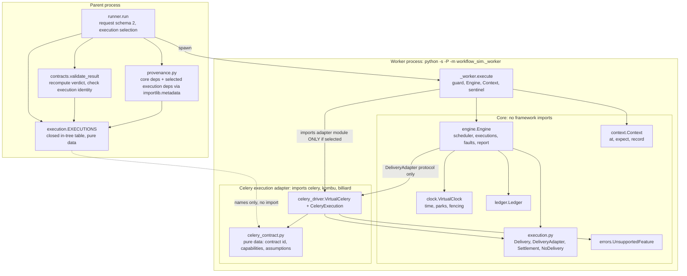
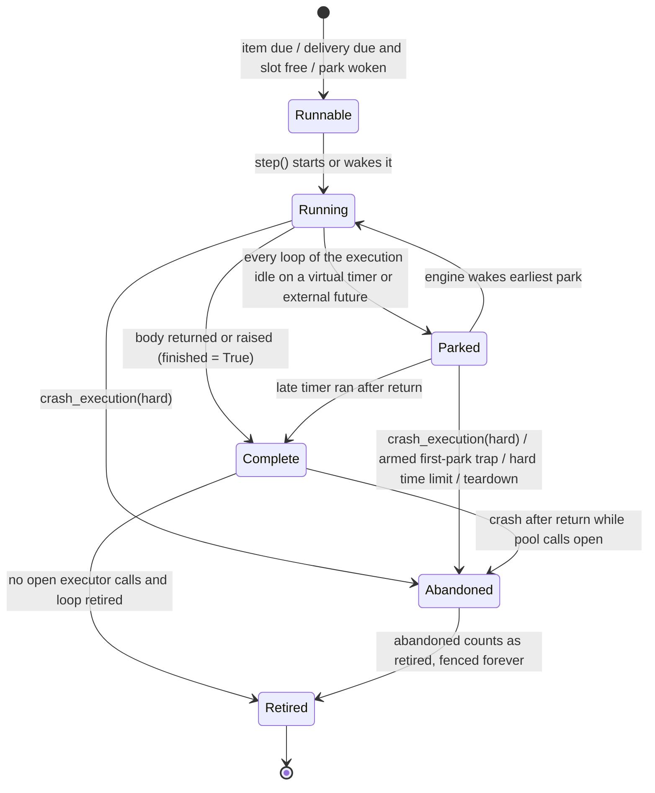
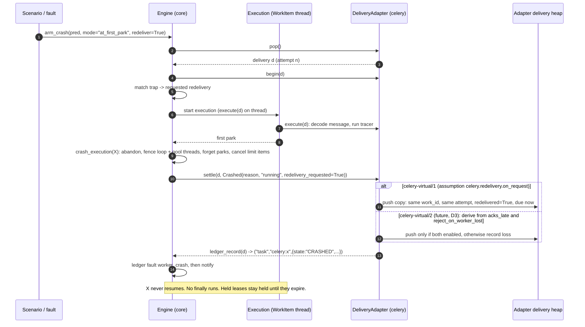
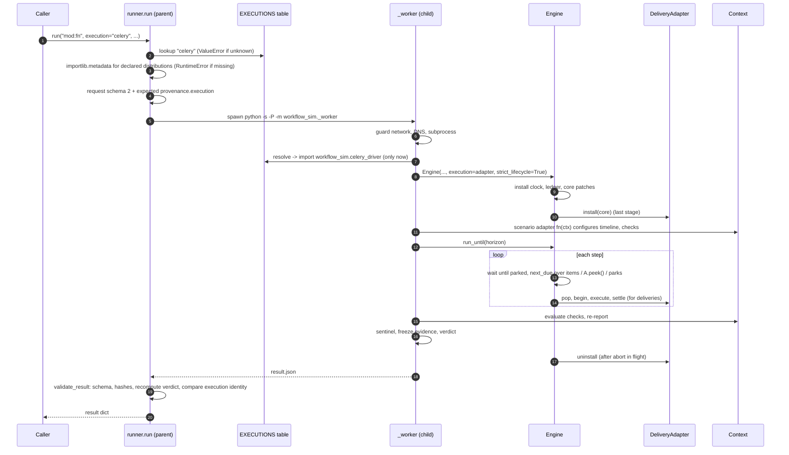
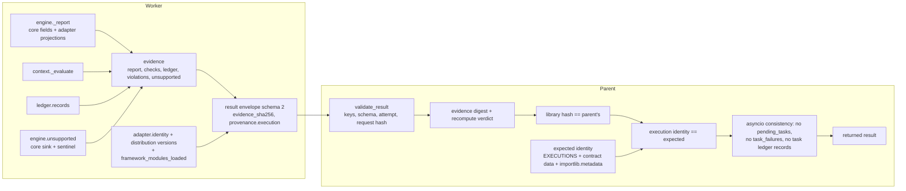

# Queue-independent core: architecture specification

| | |
|---|---|
| **Status** | Proposed design. **Nothing in this document is implemented.** See [ADR 0002](../adr/0002-queue-independent-core.md) (Proposed) and the [implementation plan](queue-independent-implementation-plan.md). |
| **Baseline analysed** | `main` = `57fa0fe97838cb2774421e99373d4f1168f2e672`; tag `v0.1.0a3` → `b19bb928784a703ee1ab7bb7e9063738d17d9080` (both verified by `git rev-parse` on 2026-09-29). |
| **Supersedes (if accepted)** | The "Celery remains a declared alpha dependency" clause of [ADR 0001](../adr/0001-alpha-boundary.md). Everything else in ADR 0001 stays. |
| **Probe environment** | CPython 3.12.13, macOS (Darwin 25.6), local wheel built from `57fa0fe`. Probe code was kept local and not committed, as the contributor rules require; §4 describes it. |

---

## 0. Recommendation in one screen

**Recommended minimal change (phase 1).** Make the engine talk to *one* private
`DeliveryAdapter` protocol instead of `VirtualCelery`. Ship two in-tree
implementations:

- `asyncio`: no deliveries at all. It never imports Celery, Kombu or Billiard.
- `celery`: today's `VirtualCelery`, byte-for-byte the same behaviour.

Selection is an explicit `execution=` argument on `run()` and `--execution` on
the CLI, recorded in the request and in provenance. In phase 1 it defaults to
`"celery"`, so every existing caller behaves as it does today. Keep
`celery_driver.py` where it is (the consumer pins that path). Remove the Celery
knowledge that leaks into the core in the places listed in §5:

- the engine's module import and construction;
- the Kombu uuid patch;
- `SoftTimeLimitExceeded`;
- the name-based classification in `_worker.py`;
- the provenance dependency list.

Phase 1 also adds two fail-closed guards:

- A **framework sentinel.** If Celery or another known in-process task framework
  is imported under `execution="asyncio"`, the result is `UNSUPPORTED` instead of
  silently losing work.
- An **`asyncio` guarantee proven by a gate.** A core-only wheel runs with the
  Celery packages absent, and `sys.modules` stays free of them.

**Kept honest.** The Celery adapter's contract is named `celery-virtual/1`, and
its *assumptions* are recorded in the evidence. The most important one is that
redelivery happens on request and does not depend on the app's ack
configuration. Recording an assumption is not a claim that the behaviour was
validated.

**What waits.**

- Moving Celery to an optional extra and flipping the default to `"asyncio"`
  (phase 3, version `0.2.0a1`).
- Deriving redelivery from the app's ack configuration (`celery-virtual/2`).
- Transport profiles such as Redis visibility timeout or RabbitMQ
  `consumer_timeout`.
- Any second framework or direct-queue backend. None of these earns support
  until a real consumer needs it and a differential check against a real worker
  or broker exists.

**Fix first, independently of the refactor.** `app.send_task(...)` bypasses the
virtual queue. Probe P4 in §4 shows a **false `PASS` on `main` today**.

---

## 1. Problem statement

workflow-sim exists to run *real* Python workflow control flow under controlled
virtual time, failures and external boundary responses. It then verifies the
observable state and content, and produces evidence that can be reproduced. Its
users span billing, fulfillment, ingestion, AI and document processing,
monitoring and meeting workflows. Most of those workflows are ordinary asyncio,
thread and pool code. Some dispatch work through a task framework.

At `57fa0fe`, Celery is structurally part of the core:

1. `engine.py` imports `workflow_sim.celery_driver` at module import time
   (`engine.py:48`). It also constructs a `VirtualCelery` for every engine
   (`engine.py:222`), whether or not the scenario uses Celery.
2. `celery_driver.py` imports `billiard`, `celery` and `kombu` at module top
   level (`celery_driver.py:42-49`). As a result, **every** run loads all three
   frameworks and patches `celery.app.task.Task.apply_async` and
   `Task.signature_from_request` (`celery_driver.py:177-220`). This includes runs
   that are pure asyncio (probe P1).
3. The parent process's `provenance()` calls
   `importlib.metadata.version("celery")`, and the same for `kombu` and
   `billiard` (`provenance.py:14`). A core-only environment therefore crashes in
   `run()` with an uncaught `PackageNotFoundError` before any worker starts
   (probe P2). The runner's documented contract is that invalid caller
   configuration raises `ValueError` and execution failures return a structured
   outcome. This is neither.
4. The core's unsupported sink *is* the Celery driver's list
   (`engine.py:231`, `self.unsupported = self.celery.unsupported`). The worker
   classifies Celery's exception **by class name** (`_worker.py:76`).
5. The fixed report fields `pending_tasks` and `task_failures`
   (`contracts.py`, `validate_result`) are populated from Celery-only state
   (`engine.py:1036-1042`), using Celery state strings.

There is also a silent-loss hazard the refactor must not widen. If a scenario
uses Celery and the Celery interception is *absent*, a `memory://` broker
accepts `delay()` and nothing ever runs (probe P3). A naive "just don't install
Celery for asyncio runs" change would turn a mis-selected Celery scenario into
work that silently disappears.

What this refactor makes possible:

- An asyncio-only user can install and run workflow-sim without Celery.
- A Celery user keeps today's semantics and tests.
- The evidence states which delivery model produced a result, and which
  assumptions that model made.
- A future backend has one explicit seam to satisfy. It does not have to
  imitate Celery's internals.

## 2. Goals and non-goals

### Goals

| ID | Goal | Measured by |
|---|---|---|
| G1 | The core owns virtual time, scheduling, execution lifecycle (process, thread, pool, async), failure injection, assertions, evidence and verdict validation. | §5 inventory items are all resolved. A static import gate shows no framework import in core modules. |
| G2 | `execution="asyncio"` runs never install, import, construct or patch Celery, Kombu or Billiard. | Clean core-only wheel gate (V1). A `sys.modules` and patch-identity gate (V2). |
| G3 | The Celery adapter keeps alpha 3 behaviour and all current tests. | The full suite passes unchanged. Evidence digests for the Celery example and confidence cases are equal before and after (V3). The real-worker contracts gate (V4) still passes. |
| G4 | Capabilities and delivery assumptions are explicit. Unsupported behaviour fails with `UNSUPPORTED` or a clear exception, never with a silent `PASS`. | Negative controls (V5). The framework sentinel. The `send_task` fix. |
| G5 | Evidence records the execution adapter name, version, contract identity, configuration, dependency versions, capabilities and assumptions. The parent validates them. | A schema 2 provenance block. Parent-side recomputation (V7). |
| G6 | No universal broker promise and no plugin registry. A new backend requires consumer demand plus conformance and differential evidence. | Support-claims matrix (§17). A closed in-tree selection table (§9). |

### Non-goals

- Modelling brokers generically. "Queue-independent core" does **not** mean
  "any queue works".
- A public adapter SDK, entry-point discovery or third-party adapter loading.
- Adding Dramatiq, RQ, Huey, arq, taskiq, Kombu-direct or SQS support in this
  refactor.
- Changing any alpha 2 or alpha 3 semantics: verdict order, lifecycle, equal-time
  ordering, crash fencing, or the ledger format for Celery runs.
- Supporting Python other than CPython 3.12, or platforms other than Linux and
  macOS.
- Making the `Context.engine` experimental surface stable.

## 3. Terminology

The repository already uses **"adapter"** for the *scenario* entrypoint
(`run("module:function")`, `docs/adapters.md`). This spec never uses the bare
word "adapter" for the new concept.

| Term | Meaning here | Examples | Owned by |
|---|---|---|---|
| **Scenario adapter** | The trusted user entrypoint `module:function(ctx)`. It configures the timeline, boundaries and checks. This is the existing term. | `workflow_sim.examples.retry:build` | User |
| **Task framework** | A library that turns a function call into a message and dispatches it to a worker. It owns task identity, retry and continuation semantics. | Celery, Dramatiq, RQ | Third party |
| **Message broker / transport** | The system that stores and delivers messages. It owns visibility, acknowledgement timeouts, redelivery and size limits. | Redis, RabbitMQ, SQS, Kombu `memory://` | Third party |
| **Execution adapter** | The in-tree component that intercepts one task framework's *publish* path and *dispatches* its deliveries as core executions. It implements `DeliveryAdapter` (§8). | `asyncio` (no deliveries), `celery` | workflow-sim |
| **Delivery model** | The adapter's explicit, versioned set of assumptions about how the (virtual) broker delivers. This covers ack timing, redelivery, duplication, expiry and delay limits. It is identified by a **contract id**. | `celery-virtual/1` | Execution adapter, declared statically |
| **Transport profile** *(future)* | Assumptions specific to one broker, layered on a delivery model, such as a visibility timeout. | *(none today)* | Future work |
| **Execution** | One `WorkItem`: a worker thread with a private loop, created for a timeline item or a delivery. | `engine.py:85` | Core |
| **Delivery** | One attempt to run a framework task, created by publish, retry, duplicate or redelivery. | `TaskRun` | Adapter creates it; core dispatches it |
| **Capability** | A named behaviour a scenario may use. It has a *status*: `unsupported`, `not_configured` or `modeled`, plus a separate *validated* binding (§11). | `retry.countdown`, `redelivery.after_crash` | Declared by the adapter; validation records are separate |

## 4. Evidence gathered for this design (probes)

The probes ran against a wheel built from `57fa0fe` in two local venvs:

- the full install;
- a core-only install: `pip install --no-deps workflow_sim-0.1.0a3-py3-none-any.whl` plus `time-machine`, with no Celery.

The probe scripts live outside the repository (in my workspace `probe/`
directory). They are not committed and are not part of any gate.

| # | Probe | Observed | Consequence for design |
|---|---|---|---|
| P1 | An asyncio-only scenario adapter that reports `sorted(m for m in sys.modules if m.split('.')[0] in {'celery','kombu','billiard'})` and `Task.apply_async.__qualname__` from inside the worker. | The worker had loaded `billiard`, `celery`, `celery.app.task`, `kombu` and more. `Task.apply_async` was `VirtualCelery.install.<locals>.apply_async`. The parent process had not imported Celery. | The coupling is real and active on every run. G2 needs a runtime gate, not just a static one. |
| P2 | `workflow_sim.run(...)` in the core-only venv. | `importlib.metadata.PackageNotFoundError: celery` was raised from `provenance()` in the **parent**, before the worker started. | Provenance must become execution-aware (§12). A missing extra must give a clear, documented error (§10). |
| P3 | With Celery installed, the scenario adapter calls `engine.celery.uninstall()` and then `job.delay()` on a `memory://` app. | The call was accepted. Nothing ran, `pending_tasks` was empty and nothing was unsupported. The outcome was `ASSERTION_FAILED` only because the scenario asserted the effect. With a `redis://` URL, the DNS guard produced `UNSUPPORTED`. | "Framework present, adapter not selected" can silently lose work. This motivates the fail-closed **framework sentinel** (§10.3). |
| P4 | Under the current Celery driver, with `memory://`, call `app.send_task('probe.job', ...)`. | **`PASS`.** No pending tasks, no unsupported entries, and only the `scenario:enqueue` ledger record. The task never ran and the harness did not notice. | This is an existing false-PASS path. `send_task` must be intercepted or rejected. It is plan unit **U0**, done before the refactor. |
| P5 | `group(a.s(), b.s()).apply_async()`. | `UNSUPPORTED` with the reason "custom producers are not modelled". | The failure is correctly closed, but the reason misleads. U0 also fixes the message. |

Behaviour I inferred but did **not** probe is marked *(unverified)* where it
appears. The main example is direct `kombu.Producer.publish` on `memory://`.

## 5. Coupling inventory (source-grounded)

Line numbers refer to `57fa0fe`.

### 5.1 Core modules that depend on Celery

| # | Location | Symbol / code | Coupling kind | Resolution |
|---|---|---|---|---|
| C1 | `engine.py:48` | `from workflow_sim.celery_driver import TaskRun, VirtualCelery` | Direct import at module load. It transitively loads celery, kombu and billiard. | Remove. The engine types against the `Delivery` / `DeliveryAdapter` protocols in the new `execution.py`. |
| C2 | `engine.py:222` | `self.celery = VirtualCelery(self.clock, seed=self.seed)` | Unconditional construction. | `self.execution = resolve(execution)`. `Engine.celery` becomes a compatibility property that exists only when the Celery adapter is selected (§13.3). |
| C3 | `engine.py:231` | `self.unsupported = self.celery.unsupported` | The core sink is owned by Celery. | The core owns `self.unsupported`. Adapters receive `CoreServices.reject`, and the Celery driver's `.unsupported` aliases the core list, so `engine.celery.unsupported is engine.unsupported` still holds. |
| C4 | `engine.py:261-262` | `self.celery.install()` / `uninstall` as an install stage | Patching Celery in every run. | The adapter installs as the **last** stage, after the core patches (see risk R3). `asyncio` installs nothing. |
| C5 | `engine.py:693-702`, `724-725` | `_patch_uuid` lazily imports `kombu.utils.uuid` and rewrites `__defaults__` | **Indirect import.** Even without C1, this line imports Kombu whenever it is installed. | Move it into the Celery adapter's install, using `CoreServices.uuid4`. |
| C6 | `engine.py:88`, `:114` | `WorkItem(kind, label, run: Optional[TaskRun])`; `id` uses `run.task_id` | The type names Celery's record. | `run: Optional[Delivery]`, with `id` taken from `delivery.work_id`. The attribute stays named `run` for compatibility with test adapters and the consumer (§13.3). |
| C7 | `engine.py:751` | `_task_slots_free` counts `kind == "task"` | A Celery-flavoured kind string that is also in the ledger. | Keep the `"task"` string. It is the delivery execution kind in ledger schema 1 and must not change. |
| C8 | `engine.py:754-767` | `_next_due` → `self.celery.peek()` | Scheduling reads the Celery heap. | `self.execution.peek()`. Rank 1 stays "delivery". |
| C9 | `engine.py:804` | `random.seed(f"{seed}:{work.id}:{getattr(run,'retries',0)}")` | Celery's attempt field. | `delivery.attempt`. The seeded string stays identical: `work_id == task_id` and `attempt == retries`. |
| C10 | `engine.py:874-882` | `arm_crash(predicate: Callable[[TaskRun], bool], ...)` | The fault API is typed on Celery. | The predicate takes a `Delivery`. Under `asyncio` it raises `UnsupportedFeature`, because the trap could never fire. |
| C11 | `engine.py:884-940` | `_run_task`: `celery.begin`, the `"CRASHED"` state string, `celery.finish`, `celery.execute`, and `celery:` labels | Delivery lifecycle hard-wired to Celery. | `_run_delivery` calls `begin` / `execute` / `settle`. Crash states are expressed as a core `Settlement`. The adapter maps it to `"CRASHED"`. |
| C12 | `engine.py:920`, `928` | Lazy `from celery.exceptions import SoftTimeLimitExceeded` | **Indirect import** of a framework error type inside the core. | `adapter.limits(d).soft_exception()`. |
| C13 | `engine.py:942-946` | `_log_task` → ledger `("task", "celery:<name>", {...})` | Evidence format. | `adapter.ledger_record(d)` returns exactly today's tuple. Byte-identical ledger for Celery (V3). |
| C14 | `engine.py:966` | `self._run_task(self.celery.pop())` | Dispatch. | `self._run_delivery(self.execution.pop())`. |
| C15 | `engine.py:1036-1046` | `pending_tasks`, and `task_failures` filtered on `("SUCCESS","RETRY","REVOKED")` | Report projection with Celery state strings. | `adapter.pending_view(d)` and `adapter.failures()`. The report keys are unchanged. |
| C16 | `engine.py:1093-1098` | `crash_execution` sets `run.state="CRASHED"`, then `celery.finish(run)` | Crash consequence decided by Celery code, called from the core. | Core: `adapter.settle(d, Crashed(...))`. The adapter decides what happens to the message (§8.4). |
| C17 | `engine.py:59` | `UnsupportedFeature(RuntimeError)` defined in the engine | Base error in a heavy module. | Move to `workflow_sim/errors.py`, with a re-export kept in `engine.py`. `UnsupportedCeleryFeature` subclasses it. |
| C18 | `_worker.py:44` | `Engine(..., strict_lifecycle=True)` with no execution choice | Selection is implicit. | Pass `execution=request["execution"]`. |
| C19 | `_worker.py:76` | `type(exc).__name__ in ('UnsupportedFeature','UnsupportedCeleryFeature','ClockRangeError')` | **Classification by name**, which names Celery inside the core. | Classify with `isinstance(exc, UnsupportedFeature)` or `ClockRangeError`. Keep name matching only as a fallback for exceptions that were re-raised or wrapped. |
| C20 | `provenance.py:14` | `importlib.metadata.version(n)` for celery, kombu and billiard | Crashes the parent when Celery is absent (P2). | Core dependencies (`time-machine`) plus the selected execution's declared distributions (§12). |
| C21 | `runner.py:43` | `provenance()` called in the parent before spawning | Makes C20 fatal in the parent. | `provenance(spec)` after resolving the execution. A missing distribution gives a clear `RuntimeError` naming the extra (§10.1). |
| C22 | `contracts.py` `validate_request` / `configuration` | Exact request key set, with no execution field | Selection cannot be recorded. | Schema 2: add `execution` (§12). |
| C23 | `pyproject.toml` `dependencies = ["celery>=5.6.3,<5.7", ...]` | Hard dependency | Stays in phase 1. Moves to the `[celery]` extra in phase 3. | |

### 5.2 Non-core surfaces that depend on the current shape

| # | Location | What depends on it | Treatment |
|---|---|---|---|
| S1 | `tests/adapters/celery_adapter.py:96,112` | `c.engine.celery.duplicate/pending/on_run_end` | Kept by the `Engine.celery` compatibility property. |
| S2 | `tests/adapters/crash_adapter.py:20`, `confidence/celery_contracts.py:96` | `w.run is not None`; `w.run.redeliver = True`; `c.engine.crash_execution` | `WorkItem.run` stays. `TaskRun.redeliver` stays and is read by the Celery settle. |
| S3 | `tests/adapters/review_adapter.py:168,210` | `c.engine.executions`, `crash_execution` on timeline executions | Core only, unchanged. |
| S4 | `scripts/check_mutations.py` `MUTANTS` | Text anchors in `engine.py` (`and (self.loop is None or self.loop_retired)`, `if future.done() and getattr(future, "_log_traceback", False):`, `self.cancel_items(lambda item: id(item) in handles)`) and `celery_driver.py` (`args, kwargs = loads(body, content_type, encoding)`, `self.unsupported.append(reason)`) | The anchors must still match exactly **once** after each unit (V9). `self.unsupported.append(reason)` moves to the core sink (C3), so the "forget-caught-unsupported" mutant is **re-anchored**, not deleted. |
| S5 | `scripts/check_package.py`, `scripts/check_examples.py` | The clean install runs every example, including `celery_retry` | Phase 1: unchanged. Phase 3: the Celery example runs only in the `[celery]` venv, and a new core-only venv runs the asyncio examples. |
| S6 | Consumer harness (`docs/validation/alpha2-consumer-*.json` `kernel_files`) | Pins `workflow_sim/celery_driver.py` **by path and hash**, plus `engine.py`, `clock.py` and others | The path is kept. Hashes change for any edit, so the consumer must re-pin. That is a normal release step, not a compatibility break. |
| S7 | Consumer use of experimental `Engine(clock_seam=, asyncio_bridge=, log_module=)` | Constructor keywords | Unchanged. The new `execution=` keyword is additive. |
| S8 | ADR 0001, `docs/releases.md` "Celery is an explicit dependency until a second real backend…" | Written promises | ADR 0002 (Proposed) amends the dependency clause only. `releases.md` changes only when phase 3 ships. |

### 5.3 Modules that are already framework-neutral

These import nothing from Celery, Kombu or Billiard, directly or indirectly:

- `clock.py` (asyncio, time_machine, `workflow_sim.time`, `workflow_sim.runtime`)
- `ledger.py`
- `runtime.py`
- `time.py`
- `context.py`
- `contracts.py`
- `cli.py`
- `runner.py`, apart from C21
- every example except `celery_retry.py`

### 5.4 The actual minimal seam

The engine touches the task framework at **fourteen** inventory points: C2 to C5,
C8 to C16, and C19. Reduced to operations, these are:

1. install and uninstall publish interception;
2. **peek**, **pop** and **list** pending deliveries, ordered by time;
3. **begin**, **execute** (on the execution thread) and **settle** one delivery;
4. supply the soft-limit exception and the limit values;
5. decide a crashed delivery's fate (redeliver or lose);
6. project pending deliveries and failures into the fixed report fields;
7. produce the delivery's ledger record;
8. report unsupported operations to the core sink.

Everything else is already core: time, parks, pools, async tracking, fencing,
teardown, verdict and evidence. **The seam is a delivery source, not a
"queue" abstraction.** It says nothing about brokers, and §14 shows why that is
the right cut.

## 6. Before and after (user view)

**Before (alpha 3).** Every run loads and patches Celery, even this asyncio-only
one:

```python
from workflow_sim import run

result = run("workflow_sim.examples.retry:build", duration=10)
# Requires celery, kombu and billiard installed. Worker patches Task.apply_async.
```

**After, phase 1.** Selection is explicit, the default is unchanged, and the
asyncio path is Celery-free:

```python
run("workflow_sim.examples.retry:build", execution="asyncio", duration=10)
#   never imports celery/kombu/billiard; provenance.execution.contract == "asyncio/1"

run("workflow_sim.examples.celery_retry:build", execution="celery", duration=10)
#   identical to alpha 3; provenance.execution.contract == "celery-virtual/1"

run("workflow_sim.examples.celery_retry:build", duration=10)
#   phase 1 default is "celery": unchanged for existing callers
```

```console
$ workflow-sim workflow_sim.examples.retry:build --execution asyncio --duration 10
```

**After, phase 3 (`0.2.0a1`).** The default becomes `"asyncio"` and Celery moves
to an extra:

```console
$ pip install workflow-sim            # core only: time-machine
$ pip install 'workflow-sim[celery]'  # adds celery>=5.6.3,<5.7
```

A Celery scenario that forgets to select Celery fails closed through the
sentinel. It does not lose work silently:

```text
outcome: UNSUPPORTED
evidence.unsupported: ["execution 'asyncio' does not model task framework 'celery'
  (imported during the run); select execution='celery'"]
```

## 7. Architecture

### 7.1 Responsibilities and dependencies



Dependency rule, enforced by gate V2a: **no module outside
`celery_driver.py` (and, later, any other adapter module) may import `celery`,
`kombu` or `billiard`, either at top level or inside a function.** `celery_contract.py` is pure data
and imports nothing from those packages, so the parent can read capabilities
without importing Celery.

### 7.2 Module layout

Phase 1 moves no files, so path pins, mutation anchors and review diffs stay
small.

```text
src/workflow_sim/
  errors.py            NEW  UnsupportedFeature (moved; re-exported by engine.py)
  execution.py         NEW  Delivery / DeliveryAdapter / Settlement / Limits /
                            ExecutionIdentity / CapabilityStatus / NoDelivery ("asyncio")
                            EXECUTIONS table / FRAMEWORK_SENTINELS / resolve()
  celery_contract.py   NEW  pure data for "celery-virtual/1" (no celery import)
  celery_driver.py     EDIT VirtualCelery unchanged in behaviour + CeleryExecution wrapper;
                            UnsupportedCeleryFeature(UnsupportedFeature); kombu uuid hook
  engine.py            EDIT remove C1-C17 coupling; execution= keyword; Engine.celery compat
  _worker.py           EDIT execution selection, isinstance classification, sentinel
  provenance.py        EDIT execution-aware dependencies
  runner.py / cli.py   EDIT execution= / --execution
  contracts.py         EDIT schema 2 request/result, execution identity validation
```

Relocating the driver to `workflow_sim/adapters/celery/` is deliberately
deferred (open decision D6). It would give only cosmetic benefit, at the cost of
another consumer re-pin.

## 8. Protocol, type and API sketches

These are sketches, not implemented code. All names are private (under
`workflow_sim.execution`) unless stated otherwise. The only public surface added
is the `execution=` argument to `run()` and `--execution` on the CLI.

### 8.1 Identity and capabilities

```python
# workflow_sim/execution.py  (core; imports only stdlib + workflow_sim.errors)
from __future__ import annotations
from dataclasses import dataclass, field
from datetime import datetime
from enum import Enum
from typing import Any, Callable, Literal, Mapping, Optional, Protocol, Sequence

class CapabilityStatus(str, Enum):
    UNSUPPORTED    = "unsupported"     # the adapter rejects any use (UNSUPPORTED verdict)
    NOT_CONFIGURED = "not_configured"  # modelled only under a config the run does not have
    MODELED        = "modeled"         # simulated under the named assumptions; NOT a validation claim

@dataclass(frozen=True)
class Capability:
    name: str                          # e.g. "retry.countdown", "redelivery.after_crash"
    status: CapabilityStatus
    assumptions: tuple[str, ...] = ()  # assumption ids, e.g. ("celery.redelivery.on_request",)
    rejection: Optional[str] = None    # where it fails closed: "publish" | "install" | "fault" | "end_of_run"

@dataclass(frozen=True)
class ExecutionIdentity:
    name: str                          # "asyncio" | "celery"
    contract: str                      # "asyncio/1" | "celery-virtual/1"
    provider: str                      # "workflow-sim==0.1.0a4" (adapters ship in-tree)
    distributions: tuple[str, ...]     # ("celery", "kombu", "billiard") -- versions resolved at runtime
    options: Mapping[str, Any]         # resolved, JSON; {} in phase 1
    capabilities: tuple[Capability, ...]
    assumptions: Mapping[str, str]     # id -> one-line statement (full text in docs/contracts.md)

    def to_json(self, versions: Mapping[str, Optional[str]]) -> dict: ...
```

### 8.2 Deliveries and settlement

```python
class Delivery(Protocol):
    """What the core needs from one delivery. Celery's TaskRun satisfies it via
    properties; no core code reads any other attribute."""
    due_at: datetime
    @property
    def order_key(self) -> tuple: ...        # adapter total order among deliveries (TaskRun: (due_at, neg_priority, seq))
    @property
    def work_id(self) -> str: ...            # stable across retries/redeliveries (Celery task_id)
    @property
    def attempt(self) -> int: ...            # seeds random; Celery: request.retries
    @property
    def label(self) -> str: ...              # execution/ledger label, e.g. "celery:deliver"

@dataclass(frozen=True)
class Limits:
    soft_seconds: Optional[float] = None
    hard_seconds: Optional[float] = None
    soft_exception: Callable[[], BaseException] = lambda: TimeoutError("soft limit")

@dataclass(frozen=True)
class Completed:         # body returned or raised; adapter's execute() already classified it
    pass

@dataclass(frozen=True)
class Crashed:
    reason: str
    phase: Literal["before_start", "running", "time_limit", "teardown"]
    redelivery_requested: bool       # from the crash trap / scenario; the adapter decides

Settlement = Completed | Crashed
```

### 8.3 Core services handed to an adapter

```python
@dataclass(frozen=True)
class CoreServices:
    now: Callable[[], datetime]                     # virtual clock; adapters never advance time
    rng: Callable[[str], "random.Random"]           # namespaced seeded RNG (e.g. "celery-ids")
    uuid4: Callable[[], "uuid.UUID"]                # the engine's seeded uuid4
    reject: Callable[[str], "NoReturn"]             # appends to engine.unsupported, raises UnsupportedFeature
    ledger_add: Callable[..., None]                 # for adapter-level fault records only
    notify: Callable[[], None]                      # wake the scheduler after an out-of-band push
```

### 8.4 The adapter protocol

```python
class DeliveryAdapter(Protocol):
    identity: ExecutionIdentity
    framework_modules: frozenset[str]              # top-level modules this adapter legitimately loads

    def install(self, core: CoreServices) -> None: ...   # last install stage; must be idempotent
    def uninstall(self) -> None: ...                     # must not raise; restores every patch

    # scheduling (engine thread, under no lock; must not block)
    def peek(self) -> Optional[Delivery]: ...
    def pop(self) -> Delivery: ...
    def pending(self) -> Sequence[Delivery]: ...

    # one delivery
    def begin(self, d: Delivery) -> None: ...            # engine thread, before trap evaluation
    def limits(self, d: Delivery) -> Limits: ...
    def execute(self, d: Delivery) -> None: ...          # execution thread; runs the body; classifies outcome
    def settle(self, d: Delivery, s: Settlement) -> None: ...
        # exactly once per delivery that began, except bodies whose execution
        # was crashed *after* return (already settled). Performs ack/retry
        # bookkeeping, continuations, errbacks, redelivery. Must not raise:
        # the Celery adapter moves today's try/except from engine._done
        # (FAILURE + "completion_error:...") inside its own settle.

    # evidence projections (fixed schema-1 report keys)
    def pending_view(self, d: Delivery) -> dict: ...      # -> report.pending_tasks[i]
    def failures(self) -> list[dict]: ...                 # -> report.task_failures
    def ledger_record(self, d: Delivery) -> tuple[str, str, dict]: ...   # ("task", "celery:x", {...})
```

`NoDelivery` implements the protocol trivially: `peek()` returns `None`,
`pending()` and `failures()` return `[]`, and `pop`, `begin`, `execute` and
`settle` are unreachable and raise `AssertionError`.

Its identity is `asyncio/1`, and its `framework_modules` set is empty. Every
delivery capability has status `unsupported`, with rejection point `fault`
(for `arm_crash`) or `end_of_run` (for the sentinel).

### 8.5 Selection (closed table, not a registry)

```python
@dataclass(frozen=True)
class ExecutionSpec:
    name: str
    module: Optional[str]          # imported ONLY in the worker, ONLY when selected
    factory: Optional[str]
    contract_module: Optional[str] # pure-data module the parent may import
    distributions: tuple[str, ...] # checked with importlib.metadata in the parent (no import)
    extra: Optional[str]           # pip extra that provides them (phase 3)

EXECUTIONS: Mapping[str, ExecutionSpec] = {
    "asyncio": ExecutionSpec("asyncio", None, None, None, (), None),
    "celery":  ExecutionSpec("celery", "workflow_sim.celery_driver", "CeleryExecution",
                             "workflow_sim.celery_contract", ("celery", "kombu", "billiard"), "celery"),
}
DEFAULT_EXECUTION = "celery"       # phase 1; becomes "asyncio" in phase 3 (D1)

def resolve(name: str, options: Mapping[str, Any], core: CoreServices) -> DeliveryAdapter: ...
```

Adding a row requires an ADR and the evidence listed in §14.4. There are no
entry points, no `importlib.metadata.entry_points()` calls and no runtime
registration API.

### 8.6 Engine constructor (experimental API, additive)

```python
Engine(*, start, seed=0, max_steps=200_000, max_real_seconds=600.0, concurrency=None,
       clock_seam=None, asyncio_bridge=None, log_module=None, strict_lifecycle=False,
       execution: str | DeliveryAdapter | None = None)   # None -> DEFAULT_EXECUTION
```

Passing an adapter *object* is for in-tree tests only. The worker always passes
a name taken from the validated request.

## 9. Ownership decisions: core vs adapter

| Concern | Owner | Decision and reasoning | Today (`57fa0fe`) |
|---|---|---|---|
| **Virtual time** | Core | Only `Engine.step` and `run_until` call `clock.advance_to`. Adapters read `core.now()` and never advance, sleep or block. | Same. |
| **Equal-time ordering** | Core (ranks), adapter (within rank) | At the same instant, items (rank 0) run before deliveries (rank 1, only when a slot is free), which run before timer wakes (rank 2). Ordering *among* deliveries is the adapter's `order_key`: `(due_at, -priority, seq)` for Celery. Parks wake one at a time in `(deadline, park order)`. | Same. Behaviour preserved exactly. |
| **Task identity** | Adapter | `work_id` is generated by the adapter from `core.rng("celery-ids")`, so it is deterministic per seed. `WorkItem.id` is derived from it. The Kombu `uuid()` default rebinding is a Celery-adapter hook (C5). The generic `uuid4` patch stays in the core. | IDs from `celery-ids:{seed}` RNG; kombu patch in engine. |
| **Serialized payloads** | Adapter | The message is encoded once at publish time (Kombu `dumps`, using the app's `task_serializer`). **Every delivery decodes the immutable encoded message again.** This is a contract requirement for any adapter declaring a `redelivery.*` or `duplicate` capability, so that mutations made by one attempt cannot leak into the next. The core never sees payloads. | `celery_driver.py` `execute` → `loads(body, ...)` per delivery (mutation anchor). |
| **Retry vs redelivery** | Adapter | A **retry** is a *new publication* made by the framework, such as `self.retry(countdown=...)` or `autoretry_for`. It keeps the same `work_id`, gets `attempt+1`, and is delayed. A **redelivery** is the *broker returning the same message* after it was not acknowledged. It has the same `work_id` and the same `attempt`, and is flagged `redelivered=True`. **Duplication** is an injected at-least-once fault. All three are delivery-model semantics. The core only reports that an execution was crashed. | Same split, implicit. |
| **Acknowledgement** | Adapter (declared as an assumption) | `celery-virtual/1` does not model ack timing. A popped delivery is consumed, *except* that a crash with redelivery requested re-queues it once. That behaviour is recorded as assumption `celery.redelivery.on_request`. It is **independent of** `task_acks_late` and `task_reject_on_worker_lost`. Real Celery redelivers after worker loss only when `acks_late` **and** `reject_on_worker_lost` are both enabled. Both are disabled by default, and `task_acks_on_failure_or_timeout` (enabled by default) acks the message otherwise ([config docs](https://docs.celeryq.dev/en/stable/userguide/configuration.html); `celery/worker/request.py` `Request.on_failure` in Celery 5.6.3, inspected locally). Deriving redelivery from the configuration is `celery-virtual/2` (open decision D3). | Redelivery happens whenever `run.redeliver` is set. `arm_crash(redeliver=True)` is the default. |
| **Expiration** | Adapter | `expires` is checked when execution starts, against virtual `now`. Once expired the delivery is `REVOKED`, never runs, and is not reported as a failure. | Same. |
| **Limits** | Split | The **values** and the **soft exception type** come from the adapter (`Limits`, from `soft_time_limit` / `time_limit`). **Enforcement** belongs to the core: virtual-time items at priority 10. The soft limit is enforced by `cancel_execution` with the adapter's exception, the hard limit by `crash_execution(reason="time_limit")`. On settle, limit items are cancelled (mutation anchor `_cancel_limits`). | Same. Exception imported lazily in the engine (C12). |
| **Continuations** | Adapter | `link`, `chain` and `link_error` are dispatched in `settle`. The call site is exactly today's: the execution future's `concurrent.futures` done callback (`engine.py` `_run_task._done`). That callback normally runs on the execution thread, but it runs on the engine thread if the body finished before the callback was registered. The refactor preserves both cases and does not "fix" them silently. A publication failure turns the delivery into `FAILURE` with `completion_error:`. | `finish()` in the done callback. |
| **Cancellation** | Core | `cancel_execution` cancels every task on the execution's loops. What the body sees (`SoftTimeLimitExceeded` or `CancelledError`) is chosen by the adapter's `Limits.soft_exception` or by the caller. | Same. |
| **Failure publication** | Split | `callback_failures` (timeline executions), unretrieved async errors (`_async_failures`), crashes and dropped timers belong to the **core**. `task_failures` is the **adapter's** projection of deliveries whose final state is a failure. The verdict function is unchanged. | Engine filters Celery state strings (C15). |
| **In-flight descendants** | Core | Tasks, futures, pool calls and threads created by any execution, including delivery bodies, are owned by that execution. They keep it un-retired and are fenced when it crashes. Adapters must not create threads or loops. Their inline work (inline errbacks) runs wherever the done callback runs (see Continuations). | Same. |
| **Crash and redelivery** | Split | The **core** decides that an execution is dead: it abandons it, fences it, drops its parks and detaches its pool threads. The **adapter** decides the message's fate through `settle(d, Crashed(...))`. See §10.4. | Engine sets `"CRASHED"` and calls `celery.finish` (C16). |
| **Unsupported signals** | Core sink, adapter reasons | `engine.unsupported` is core-owned and **sticky**: it is recorded even if application code catches the exception. Adapters call `core.reject(reason)`, which raises an `UnsupportedFeature` subclass. The worker classifies with `isinstance`. | Celery-owned list (C3), name-based classification (C19). |
| **Concurrency slots** | Core | `concurrency` limits executions of kind `"task"` (delivery executions). | Same. |
| **Random seeding** | Core, and optionally the adapter | The core seeds each execution with `f"{seed}:{work_id}:{attempt}"`. The Celery adapter re-seeds with the identical string before the tracer. This is harmless, and is kept so the random stream stays byte-identical. | Same strings. |

## 10. Lifecycle, selection and failure behaviour

### 10.1 Selection and missing dependencies

There is **no auto-detection.** Selection comes only from `run(execution=...)`,
the CLI `--execution` option or `Engine(execution=...)`.

| Situation | Where detected | Behaviour |
|---|---|---|
| Unknown `execution` name | Parent, `validate_request` | `ValueError("unknown execution 'x'; known: asyncio, celery")`. This matches the documented rule that invalid caller configuration raises `ValueError`. |
| `execution="celery"`, Celery not installed | Parent, `importlib.metadata.distribution(...)` for each declared distribution, **before spawn and without importing** | `RuntimeError("execution 'celery' requires: celery, kombu, billiard (install 'workflow-sim[celery]')")`. This is the same class the runner already raises for an unsupported platform. The CLI exit code is 4. |
| `execution="celery"`, Celery version outside the tested `5.6.x` range | Worker, adapter install | `UNSUPPORTED`: "celery 5.7.0 is outside the modelled range 5.6.x". The adapter depends on version-sensitive internals (`build_tracer`, `Task.signature_from_request`). |
| Celery import fails in the worker (broken install) | Worker | `HARNESS_ERROR` with the import error. The result stays structured. |
| `execution="asyncio"`, Celery installed but unused | n/a | Runs normally. Celery is never imported (V2). |
| `execution="asyncio"`, scenario imports Celery or another known framework | Worker, **end of run** (sentinel, §10.3) | `UNSUPPORTED`. The imported frameworks are listed in `provenance.execution.framework_modules_loaded`. |

### 10.2 Execution states and invariants

These definitions restate `engine.py` as of `57fa0fe`. The refactor must
preserve every one of them for both executions.



| State | Definition (source) | Counted as outstanding? |
|---|---|---|
| Runnable | Candidate in `_next_due`: heap item, `execution.peek()` when `_task_slots_free()`, or earliest park. | Yes: `pending_items` or `pending_tasks`, or an `in_flight` park. |
| Running | A thread executing Python. The engine waits in `_wait_until_parked`. | The engine never advances while anything is running. |
| Parked | `WorkItem.is_parked(sched)`: all loops parked with no woken park. `when=None` means blocked on an external future (`blocked_on_external`). | Yes: `in_flight`. |
| Complete | `finished=True`. The body is done, but the loop may hold live timers or executor calls. | Yes, until retired (`in_flight` lists `not w.retired()`). |
| Retired | `retired()` = abandoned, or finished with no `executor_calls` and the loop retired. `settled() == retired()`. | No. |
| Abandoned | Hard crash or teardown: fenced, parks forgotten, pool threads detached, and **no `finally` runs**. | No, but listed in `crashes` and `budget.abandoned_threads`. |
| Failed | Complete with an error. For timeline executions this appears in `callback_failures`. For deliveries it appears in `task_failures`, via the adapter. Unretrieved async errors appear in `callback_failures` through `_async_failures`. | Not outstanding, but produces `HARNESS_ERROR` by the verdict order. |

**Invariants (normative).**

1. **I1: single time owner.** Only the engine advances the clock. An adapter
   operation must never call `advance_to`, sleep or wait on the scheduler
   condition.
2. **I2: deterministic handoff.** After every step, the engine waits until every
   active execution is parked or finished before it looks at `_next_due`
   again. Adapter `peek`, `pop` and `pending` are called only from the engine
   thread, while that condition holds.
3. **I3: outstanding work** is the union of `in_flight`, `pending_items`,
   `pending_tasks` and `dropped_timers`, plus any stop reason other than
   `horizon`. If any of these is non-empty, the verdict is `INCOMPLETE`. Under
   `asyncio`, `pending_tasks` is always `[]` by construction, and the parent
   checks this (V7).
4. **I4: settle exactly once.** Every delivery that began is settled exactly
   once:
   - `Completed`, from the done callback, when not abandoned;
   - `Crashed(before_start)`, from an `at_start` trap;
   - `Crashed(running)` or `Crashed(time_limit)`, from `crash_execution` before
     the body returned;
   - `Crashed(teardown)`, from `_abort_in_flight`.

   A crash *after* the body returned (only pool calls were left open) is not
   settled again.
5. **I5: descendants keep executions alive.** An execution with open pool calls
   or live loop timers is not retired. Its errors are attributed to it. A hard
   crash fences the execution's loop threads *and* its running pool threads,
   and queued pool submissions never start.
6. **I6: teardown order.** `uninstall()` first abandons in-flight work while
   every hook is still installed (`_abort_in_flight("uninstall")`). It then
   unwinds the stages in reverse, so the adapter uninstalls **first**, because
   it installs last.

   Settlements made during teardown can add ledger records. The worker reads
   the ledger *after* the `with engine:` block, so these do appear. They
   **cannot** change the already-frozen report, and they must not raise.
   Redeliveries enqueued at teardown are never run. This is today's behaviour,
   and it is now written down.
7. **I7: sticky unsupported.** Once a reason is in `engine.unsupported`, the
   verdict is `UNSUPPORTED`, whatever the application catches.
8. **I8: no hidden work.** Under `asyncio`, a publish path of a known framework
   must not be silently accepted. Phase 1 enforces this with the sentinel. The
   sentinel does not detect specific publish calls (§10.3).

Alpha 2 semantics that are explicitly preserved:

- the equal-time tie rule;
- park wake order;
- the strict lifecycle rule (`run_coro_sync` outside an owned execution is
  `UNSUPPORTED`);
- descendant ownership and fencing;
- first-park crash traps never start the coroutine;
- JSON payload decoding per delivery;
- the verdict order `UNSUPPORTED` → `INCOMPLETE` → `HARNESS_ERROR` → no checks → `ASSERTION_FAILED` → `PASS`;
- the result and evidence key sets;
- the Celery ledger format.

### 10.3 The framework sentinel (fail-closed, never used for selection)

At the end of the run, before the evidence is frozen, `_worker.execute` computes
the set of loaded framework modules:

```python
FRAMEWORK_SENTINELS = ("celery", "kombu", "billiard", "dramatiq", "rq", "huey", "taskiq", "arq")
loaded = {m.split(".")[0] for m in sys.modules} & set(FRAMEWORK_SENTINELS)
unmodelled = loaded - adapter.framework_modules
```

If `unmodelled` is non-empty, the worker appends one sticky unsupported reason
for each framework. The sentinel only reads `sys.modules`. It never imports,
patches or selects anything.

**Scope, stated honestly.** This is a heuristic denylist of frameworks that ship
in-process brokers able to swallow messages. The list is based on those projects'
documented stub or memory brokers, but only Celery/Kombu `memory://` was probed
(P3).

- **It fails closed on imports, not on use.** A code base that imports Celery
  only for type hints gets `UNSUPPORTED` under `asyncio`. The remedy is to
  select `celery`. An explicit "acknowledged but unmodelled" option is open
  decision D5, and deferral is recommended.
- **Absence proves nothing.** A queue client not on the list (boto3 SQS, aiokafka, a
  hand-rolled Redis list) is an *external boundary*. It is caught by the
  network guard (`_worker.guard`), or replaced by a scenario fake (§14).

### 10.4 Crash and redelivery ownership



Crash paths that must be covered by tests (V6), with the settlement each one
produces:

| Path | Trigger | Settlement | Redelivery decision |
|---|---|---|---|
| `at_start` trap | `arm_crash(mode="at_start")` | `Crashed(before_start)`, and no execution thread starts | Adapter |
| `at_first_park` trap | `arm_crash()` | `Crashed(running)`, and the coroutine never starts | Adapter |
| Manual hard crash | `crash_execution(w)` while parked | `Crashed(running)` | Adapter |
| Hard time limit | Limit item at priority 10 | `Crashed(time_limit)` | Adapter (`celery-virtual/1`: redelivers only if requested) |
| Crash after return | Pool calls still open | *No second settle* | n/a |
| Soft crash | `crash_execution(hard=False)` → `SimulatedWorkerCrash` inside the body | `Completed`, and the adapter classifies the result as `CRASHED` | Adapter |
| Soft time limit | `cancel_execution(w, adapter soft exc)` | `Completed`, with `FAILURE` "soft time limit" | None |
| Teardown | `_abort_in_flight` | `Crashed(teardown)` | Enqueued but never run (I6) |
| Timeline execution crash | `crash_execution` on a `ctx.at` item | No settle (`w.run is None`) | None: there is no broker, so nobody re-runs it |

### 10.5 Run lifecycle



## 11. Capability contract

### 11.1 The four statuses, and why declarations are not proof

| Status | Meaning | Emitted at runtime? | Effect on a scenario that uses it |
|---|---|---|---|
| `unsupported` | The adapter does not model this behaviour. | Yes, in identity | Rejected at its rejection point, giving `UNSUPPORTED`. |
| `not_configured` | Modelled only under a configuration the run does not have. Example (`celery-virtual/2`): redelivery after a crash when `acks_late` is off. | Yes | Rejected, giving `UNSUPPORTED`, with a reason naming the missing configuration. |
| `modeled` | Simulated under named, documented assumptions. | Yes, with assumption ids | Runs. The evidence carries the assumption ids. |
| **validated** | A `modeled` capability, under a specific contract id and dependency versions, that has a passing differential check against a real worker or broker, recorded in `docs/validation/*.json`. | **Never.** Runtime code cannot vouch for itself. | None at runtime. It appears only in the support-claims matrix (§17), which cites validation records. |

The Celery adapter's capabilities for `celery-virtual/1` are listed below. This
is the pure-data content of `celery_contract.py`, derived from the
`celery_driver.py` docstring and code:

| Capability | Status | Rejection point | Assumption ids | Validated evidence today |
|---|---|---|---|---|
| `publish.apply_async`, `publish.delay`, `publish.signature` | modeled | n/a | `celery.publish.intercepted` | `confidence/celery_contracts.py` (Redis, prefork) |
| `publish.send_task` | **unsupported** after U0 (today: *silently unmodelled*, P4) | publish | n/a | n/a |
| `publish.kombu_direct` | unsupported *(not intercepted; unverified whether the sentinel sees it: Kombu is an expected module under `celery`)* | none today, which is a known gap (§18) | n/a | n/a |
| `schedule.countdown_eta` | modeled | n/a | `celery.eta.virtual`, `transport.no_visibility_redelivery` | retry-chain case |
| `expires` | modeled | n/a | `celery.expires.at_start` | expiry case |
| `priority` | modeled | n/a | `celery.priority.global_order` *(real brokers order per queue and transport; not validated)* | none |
| `retry`, `autoretry` | modeled | n/a | `celery.retry.republish` | retry-chain case |
| `link`, `link_error`, `chain` | modeled | n/a | `celery.continuations.worker_side` | retry-chain case (chain) |
| `chord`, `group`, `shadow`, `rate_limit`, `router`, `producer`, `connection`, `publisher`, `add_to_parent`, `group_id`, `group_index`, `chord_size` | unsupported | publish | n/a | negative tests |
| `time_limit.soft`, `time_limit.hard` | modeled | n/a | `celery.limits.virtual_time` | none against a real worker |
| `redelivery.after_crash` | modeled | n/a | **`celery.redelivery.on_request`** (independent of ack config) | worker-loss case, which was run with `acks_late=True` and `reject_on_worker_lost=True`, so it validates the configured case only |
| `duplicate`, `drop`, `delay`, `revoke` (fault API) | modeled | n/a | `fault.injected` | duplicate-json case (duplicate) |
| `transport.visibility_timeout` | unsupported (not modelled) | none today (§15) | n/a | n/a |

### 11.2 Rejection points

1. **Request** (parent): unknown execution name, or malformed options, raises
   `ValueError`.
2. **Environment** (parent): a missing distribution raises `RuntimeError`.
3. **Install** (worker): an out-of-range framework version, or options the
   adapter cannot honour, give `UNSUPPORTED`.
4. **Publish** (worker, synchronous): an unsupported option or path raises
   `core.reject`. The reason is sticky, so `UNSUPPORTED` holds even if the
   exception is caught.
5. **Fault** (worker): using a fault API the selected adapter lacks, such as
   `arm_crash` under `asyncio`, raises `UnsupportedFeature`.
6. **End of run** (worker): the framework sentinel.

### 11.3 Immutable provenance

`ExecutionIdentity` is a frozen dataclass, built once when the adapter is
resolved. It is serialized into `result.provenance.execution`:

```json
{
  "name": "celery",
  "contract": "celery-virtual/1",
  "provider": "workflow-sim==0.1.0a4",
  "distributions": {"celery": "5.6.3", "kombu": "5.6.1", "billiard": "4.2.2"},
  "options": {},
  "capabilities": {"redelivery.after_crash": {"status": "modeled", "assumptions": ["celery.redelivery.on_request"]}, "...": {}},
  "assumptions": {"celery.redelivery.on_request": "a crashed delivery is re-queued once iff redelivery was requested, independent of task_acks_late/task_reject_on_worker_lost"},
  "framework_modules_loaded": ["billiard", "celery", "kombu"]
}
```

The parent independently computes the expected block from the `EXECUTIONS`
table, the pure-data contract module and `importlib.metadata`. This involves no
framework import. `validate_result` rejects the result if any field other than
`framework_modules_loaded` differs. The adapter's source is already covered by
`library_sha256`, which hashes every `*.py` file in the package.

The versions shown in the example are illustrative. The real values are
resolved at runtime.

### 11.4 Schema and API versioning

| Artifact | Change | Version decision |
|---|---|---|
| Request | New required key `execution: {"name": str, "options": {}}` | **Schema 2.** `validate_request` checks an exact key set, so a new key within schema 1 would break schema 1's own contract. |
| Result envelope | Same keys. `provenance.execution` is added, and `provenance.dependencies` is execution-dependent. | **Schema 2** (same number as the request). |
| Evidence / report | **Unchanged key sets.** `pending_tasks` and `task_failures` keep their names and are always present (empty under `asyncio`). | Unchanged. The verdict function is byte-identical. |
| Ledger records | Unchanged for Celery. No new record kinds under `asyncio`. | Unchanged. |
| `configuration(request)` | Adds `execution` | Part of schema 2. |
| Contract ids | `asyncio/1`, `celery-virtual/1` | Any behaviour change in a delivery model bumps its id. This includes U0-after-seam semantics and ack-derived redelivery. |
| `run()` / CLI | `execution=` / `--execution` added | Additive in phase 1. The default changes in phase 3 (a breaking alpha change, listed in the CHANGELOG). |

### 11.5 Historical results and replay compatibility

- Historical proof runs **execute their pinned wheel** (see `docs/architecture.md`:
  "Harness manifest hashes the wheel and copies it into historical replays").
  They are validated by that wheel's own `validate_result`. Nothing in this
  design changes old wheels.
- The new library's `validate_result` accepts **only schema 2** for fresh runs.
  An *optional* read-only `contracts.describe_legacy(result)` would map schema 1
  results to the implied identity `{"name": "celery", "contract": "celery-virtual/1"}`
  for reporting. It **never re-validates a PASS**. This is open decision D4,
  recommended as "defer until someone needs it".
- The `docs/validation/*.json` records remain statements about the versions
  they name. None of them is re-labelled as evidence for the refactored code.

## 12. Evidence and validation flow



## 13. Usage, packaging and compatibility

### 13.1 Usage examples

**Synchronous callbacks (no framework).** This works under either execution.
Under `asyncio` it never touches Celery.

```python
def build(ctx):
    ledger = []
    ctx.at(0, "charge", lambda: ledger.append("charged"))
    ctx.at(30, "refund-window-closes", lambda: ledger.append("closed"))
    ctx.expect("order", lambda: ledger, ["charged", "closed"])

# run("billing_scenarios:build", execution="asyncio", duration=60)
```

**Asyncio only.** This covers timers, tasks, `to_thread` and a crash of a
timeline execution. There is no broker, so a crashed callback is simply gone
unless the scenario itself models a retry.

```python
import asyncio

def build(ctx):
    seen = []

    async def poll():
        for i in range(3):
            seen.append(["poll", i])
            await asyncio.to_thread(lambda: None)     # owned pool call
            await asyncio.sleep(60)                   # virtual time

    ctx.at(0, "poller", poll)
    def kill():
        w = next(w for w in ctx.engine.executions if w.label == "poller")   # experimental API
        ctx.engine.crash_execution(w, reason="oom")
    ctx.at(90, "kill", kill)
    ctx.expect("polls before crash", lambda: seen, [["poll", 0], ["poll", 1]])

# run("ingest_scenarios:build", execution="asyncio", duration=300)
```

These two sketches are illustrations and were **not executed** for this spec.
The runnable examples are the ones in `src/workflow_sim/examples/`.

**Celery.** This is `examples/celery_retry.py`, unchanged, and it must be
selected explicitly once phase 3 ships:

```python
from celery import Celery

def build(ctx):
    app = Celery("example", broker="memory://", backend="cache+memory://")
    attempts, delivered = [], []

    @app.task(bind=True, name="workflow_sim.example.deliver", max_retries=1)
    def deliver(self, payload):
        attempts.append(self.request.retries)
        if self.request.retries == 0:
            raise self.retry(countdown=3)
        delivered.append(payload)

    ctx.at(0, "enqueue", lambda: deliver.delay({"id": "order-7", "items": ["book"]}))
    ctx.expect("delivered content", lambda: delivered, [{"id": "order-7", "items": ["book"]}])
    ctx.expect("retry lineage", lambda: attempts, [0, 1])

# run("workflow_sim.examples.celery_retry:build", execution="celery", duration=10)
```

### 13.2 Packaging and defaults

| | Phase 1 (`0.1.0a4`) | Phase 3 (`0.2.0a1`) |
|---|---|---|
| `dependencies` | `celery>=5.6.3,<5.7`, `time-machine` (unchanged) | `time-machine>=3.5.1,<4` only |
| `[celery]` extra | Added as a no-op alias, so users can write `workflow-sim[celery]` early | `celery>=5.6.3,<5.7` |
| `[dev]` extra | Unchanged | Adds `celery`, because the tests need it |
| Default `execution` | `"celery"` (identical behaviour) | `"asyncio"` (D1) |
| Core-only install | Proven by a `--no-deps` gate (V1) | Proven by a plain `pip install workflow-sim` gate |

### 13.3 Backward compatibility

| Surface | Promise |
|---|---|
| `run()` without `execution` | Phase 1: identical to alpha 3. Phase 3: means `"asyncio"`. Celery scenarios fail closed through the sentinel with an actionable reason. |
| `workflow_sim.celery_driver` import path, `TaskRun`, `VirtualCelery`, `UnsupportedCeleryFeature` | Kept, importable and behaviourally identical. `UnsupportedCeleryFeature` gains the base class `UnsupportedFeature`, which is still a `RuntimeError`. |
| `Engine.celery` (experimental) | A property. It returns the `VirtualCelery` when `execution="celery"`. Otherwise it raises `AttributeError("Engine.celery exists only with execution='celery'")`. |
| `Engine.unsupported` | Always the core list. `engine.celery.unsupported is engine.unsupported` still holds. |
| `WorkItem.run` | Kept: the `Delivery` or `None`. For Celery it is still the `TaskRun`, so `w.run.redeliver = True` keeps working. |
| `Engine.arm_crash` predicate | Receives the same `TaskRun` for Celery. Under `asyncio` it raises `UnsupportedFeature`. |
| Ledger, report and evidence formats | Unchanged. |
| Result `schema_version` | 1 → 2. Any tooling that asserts `== 1` must update (R5). |
| Consumer kernel pins | The path is unchanged. The hashes change, so the consumer re-pins (a normal release step). |

### 13.4 Preventing Celery in the core path

- **Static (V2a).** An AST scan over `src/workflow_sim/**/*.py`, excluding the
  adapter module allow-list (`celery_driver.py`, `examples/celery_retry.py`),
  rejects any `import`/`from` of `celery`, `kombu` or `billiard` at *any* nesting
  depth. It also rejects `importlib.import_module` or `__import__` with those
  literals. This catches C5- and C12-style lazy imports.
- **Runtime (V2b), in two parts.**
  1. *Worker.* An `execution="asyncio"` scenario running through `run()` in
     a venv that has Celery installed records the framework modules present in
     `sys.modules` at the end of the run. The list must be empty. A module that
     was never imported cannot have been patched. This is P1 turned into a
     regression test.
  2. *In process.* A test imports `celery.app.task.Task` first and saves
     `Task.apply_async`. It then enters and exits
     `Engine(execution="asyncio")`, and asserts the attribute is the same object
     both inside the block and afterwards.
- **Environment (V1).** A core-only wheel is run in a venv where
  `importlib.util.find_spec("celery") is None`.

## 14. Stress test: a second framework and a direct-queue consumer

### 14.1 Direct SQS consumer walked through the seam

The workload is an application loop that calls boto3 `receive_message`, then
processes the message, then calls `delete_message`, using a visibility timeout.

| Case | Real behaviour (primary docs, fetched 2026-09-29) | Does it fit `DeliveryAdapter`? |
|---|---|---|
| **Publish** | `SendMessage` `DelaySeconds` is 0–900 s and cannot be set per message on FIFO queues. Bodies are at most 1 MiB, with a restricted character set ([SendMessage](https://docs.aws.amazon.com/AWSSimpleQueueService/latest/APIReference/API_SendMessage.html)). | A fake could map it to `due_at`. There is no framework publish path to *intercept*: the call is a network boundary. |
| **Receive** | This is **pull**. The *application* owns the loop and decides when to poll. A received message is invisible for the visibility timeout, which defaults to 30 s and has a 12 h maximum from the first receive ([visibility timeout](https://docs.aws.amazon.com/AWSSimpleQueueService/latest/SQSDeveloperGuide/sqs-visibility-timeout.html)). | **No.** `DeliveryAdapter.pop` → `execute` assumes the *framework* dispatches a body into an execution. Here the dispatcher is user code that already runs as an ordinary asyncio execution. |
| **Ack** | `DeleteMessage` needs the *most recent* receipt handle. With an old handle "the request will succeed, but the message might not be deleted." Standard queues may return a message even after it was deleted ([DeleteMessage](https://docs.aws.amazon.com/AWSSimpleQueueService/latest/APIReference/API_DeleteMessage.html)). | This is boundary-fake state: receipt handles, receive count and visibility. It is not an execution concern. |
| **Retry** | There is no framework retry. The message reappears after the visibility timeout, or immediately via `ChangeMessageVisibility(0)`. Delivery is at-least-once even within the timeout. | The fake schedules reappearance with core `engine.at` items. That is core time and needs no adapter. |
| **Crash** | The consumer process dies, and the message becomes visible again after the timeout, with `ApproximateReceiveCount+1`. | `crash_execution` on the poller's execution (core) plus the fake's visibility timer. It works with **`execution="asyncio"`** today. |

**Conclusion.** A direct-queue consumer is **not** an execution adapter. It is
ordinary asyncio code talking to an external boundary, and that boundary is
replaced by a scenario-owned fake that uses core time. This is exactly what the
product already does for HTTP and storage boundaries. It validates the cut in
§5.4: the seam is a *framework dispatch* seam, not a queue seam.

What *would* be needed is a well-tested fake with documented SQS semantics
(receipt handles, visibility, receive count, `DelaySeconds` bounds). Its
fidelity claim needs its own differential check against real SQS or a
documented emulator. It is not in phase 1.

### 14.2 A second framework (Dramatiq) walked through the seam

Sources: the [Dramatiq user guide](https://dramatiq.io/guide.html), fetched
2026-09-29. It documents that `send` enqueues without running, that arguments
must be JSON-encodable, retries with exponential backoff (`max_retries` default
20, `min_backoff` 15 s, `max_backoff` 7 days), `max_age`, dead letters, time
limits (default 10 min, "best-effort", killed with `TimeLimitExceeded`) and
`send_with_options(delay=...)`, which produces an `eta`. **The fetched guide does
not state ack timing or crash semantics.** Anything this section says about
those is unverified.

| Seam operation | Dramatiq mapping | Fits? |
|---|---|---|
| Install / publish interception | `Broker.enqueue` (a StubBroker exists for tests) | Yes, as one intercept point, analogous to `Task.apply_async`. |
| `order_key` / `due_at` | `eta` from `delay` | Yes. |
| `work_id` / `attempt` | `message_id`; retries tracked in `message.options["retries"]` *(unverified field name)* | Probably. Needs source inspection. |
| `execute` | Actor call with a middleware chain | Plausible. Middleware ordering is the main fidelity risk. |
| `settle` | The Retries middleware re-enqueues with a delay, and dead-letters after limits | Yes. The retry is a republication, the same split as Celery. |
| Crash → redelivery | Broker-dependent *(unverified)* | The seam holds: `Crashed(...)` goes to the adapter, and the adapter decides. The *assumption* would need its own id and evidence. |
| Limits | Soft and hard limits collapse into one `TimeLimitExceeded` | Yes: `Limits(hard_seconds=None, soft_seconds=..., soft_exception=TimeLimitExceeded)`. |

**Conclusion.** The protocol appears sufficient for a push-dispatch framework
without changes. The risk lives in the *delivery model assumptions*, not in the
seam.

### 14.3 Recommendation

**Keep a second backend out of phase 1.** Nothing in the repository or the known
consumer needs one. The meeting consumer uses Celery, and the other domain
examples are asyncio-only. A sketch implemented without a consumer would
produce an unvalidated support claim, which is exactly what the product must
not do.

### 14.4 Evidence that would decide adding a backend

1. **Demand.** A named consumer repository and revision, and a workflow in it
   that uses the framework, with a real past bug the simulator should reproduce
   (a before-fail/after-pass proof).
2. **Differential check.** A real-worker harness, like
   `confidence/celery_contracts.py`, covering publish, delay, retry, crash with
   the framework's real ack setting, duplicate delivery with the original
   payload, and expiry or age limits. It must run in CI against the real broker
   the consumer uses.
3. **Conformance.** The core conformance suite (V3, V6) passes with the new
   adapter unchanged.
4. **Honest identity.** A contract id, an assumption list, and a support-matrix
   row stating exactly which broker and configuration were validated.

## 15. Framework support vs transport conformance

Celery with Redis evidence does **not** establish RabbitMQ, SQS or native SQS
behaviour. The table below lists transport facts, from primary docs fetched
2026-09-29, that the current Celery model does **not** simulate. Each one would
need its own transport profile and differential evidence.

| Transport fact | Source | Simulated by `celery-virtual/1`? | Consequence |
|---|---|---|---|
| Redis: the default visibility timeout is 1 h. Unacked tasks are redelivered after it. An ETA, countdown or retry beyond the timeout re-executes "again, and again in a loop". Messages are redelivered at worker shutdown. When several apps share a broker, the shortest timeout wins. | [Celery: Using Redis](https://docs.celeryq.dev/en/stable/getting-started/backends-and-brokers/redis.html) | **No.** A countdown of 2 h delivers once in the simulator. | Assumption `transport.no_visibility_redelivery`. A future `redis` profile should reject, or model, `countdown > visibility_timeout`. |
| RabbitMQ: `consumer_timeout` defaults to 30 min, checked each minute. Since 4.3 only quorum queues support it. On timeout the channel closes with `PRECONDITION_FAILED` and its unacked deliveries are requeued. `redelivered` is set for previously delivered messages. | [RabbitMQ: Consumers](https://www.rabbitmq.com/docs/consumers) | **No.** | A long-running `acks_late` task may be redelivered mid-run. Not modelled. |
| SQS via Celery: the default visibility timeout is 30 min. The option has no effect with predefined queues. The same ETA loop hazard applies, with a 12 h AWS maximum. There are no remote control, events or result backend. The backoff policy uses the visibility timeout and `ApproximateReceiveCount`. | [Celery: Using Amazon SQS](https://docs.celeryq.dev/en/stable/getting-started/backends-and-brokers/sqs.html) | **No.** | `revoke` via remote control does not exist on SQS, but the simulator's `revoke` fault works regardless. Any SQS claim needs its own evidence. |
| Native SQS: the default visibility timeout is 30 s. Delivery is at-least-once even within the timeout. `DelaySeconds` is at most 900 s. FIFO queues use group ordering and a 5 min dedup window. Receipt-handle rules apply. | [Visibility timeout](https://docs.aws.amazon.com/AWSSimpleQueueService/latest/SQSDeveloperGuide/sqs-visibility-timeout.html), [SendMessage](https://docs.aws.amazon.com/AWSSimpleQueueService/latest/APIReference/API_SendMessage.html), [DeleteMessage](https://docs.aws.amazon.com/AWSSimpleQueueService/latest/APIReference/API_DeleteMessage.html) | n/a (§14.1) | A boundary fake, not an execution adapter. |
| Celery worker-loss acknowledgement: `task_acks_late` is off by default, `task_reject_on_worker_lost` is off by default, and `task_acks_on_failure_or_timeout` is on by default. Enabling reject-on-lost "can cause message loops". | [Celery configuration](https://docs.celeryq.dev/en/stable/userguide/configuration.html) | **Partially.** Redelivery is on request, not derived from configuration. | Assumption `celery.redelivery.on_request`. D3 is phase 2. |

The existing real-worker evidence (`docs/validation/alpha3-release.json`) covers
the following, and nothing more:

- Celery 5.6.3, redis-py 6.4.0, Redis server 7.4.11;
- the prefork pool on Linux;
- `acks_late=True`, `reject_on_worker_lost=True`, prefetch 1;
- the four cases retry-chain, duplicate-json, worker-loss and expiry.

## 16. Functional validation plan

Every gate below is a *functional* test. It runs a scenario through `run()` or
an installed wheel, and asserts the resulting content and state, not just that
calls happened. For each gate, "bugs caught" names the plausible defect. The
[implementation plan](queue-independent-implementation-plan.md) requires that
defect to be introduced temporarily, and the gate seen to fail, before the gate
is accepted.

| Gate | What runs | Bugs it catches | What it cannot certify |
|---|---|---|---|
| **V1 Clean core-only wheel** | Build a wheel. Install it into a fresh venv with `--no-deps` (phase 1) or plain (phase 3), plus `time-machine`. Assert `find_spec("celery") is None`, then run every asyncio example with `execution="asyncio"` and compare the checks with expected content. Then run `execution="celery"` and assert a `RuntimeError` naming the extra. | P2 regressions. A core module importing Celery lazily. Provenance hard-requiring Celery metadata. A missing-extra case that produces an uncaught `PackageNotFoundError`. | That the wheel works on platforms or Pythons other than CPython 3.12 on Linux and macOS. |
| **V2a Static import gate** | AST scan (§13.4). | Top-level, function-level and `importlib` imports of framework modules in the core. The C5 and C12 patterns. | Dynamic imports built from computed strings. Imports made by *user* code. |
| **V2b Runtime isolation** | `execution="asyncio"` scenario in a venv that *has* Celery. Assert no `celery`/`kombu`/`billiard` in the worker's `sys.modules`, and `provenance.execution.framework_modules_loaded == []`. Separately, an in-process `Engine(execution="asyncio")` must leave a pre-imported `Task.apply_async` untouched (§13.4). | P1 regressions: the adapter installed despite the selection, or the Kombu uuid patch still running. | Third-party libraries that import Celery transitively. The sentinel handles those, and V5 tests it. |
| **V2c Stock asyncio comparison** | The existing `test_generated_execution` Hypothesis program (35 derandomized examples), run with `execution="asyncio"` **and** `"celery"`, compared to `asyncio.run` and to independently computed content. | A core scheduling change hidden behind the Celery path. Asyncio behaviour that depends on the adapter. | Orderings that stock asyncio leaves unconstrained, which the existing test already refuses to treat as an oracle. |
| **V3 Celery regressions (byte identity)** | The full existing suite, unchanged. **Plus**: for the `celery_retry` example, the four `confidence/celery_contracts.py` simulated cases and every `tests/adapters/celery_adapter.py` mode, the *evidence digest* (`evidence_sha256`) produced by `57fa0fe` equals the refactored one with the same seed. | Changed ledger labels or data. Changed task ids from an RNG order shift (R3). Changed state strings. Settle order drift. Limit items not cancelled. Continuations run at a different time. | Real-worker equivalence. Only V4 speaks to that. Digest identity also cannot show the *old* behaviour was right. |
| **V4 Real-worker contracts** | `scripts/check_celery_contracts.py` on Linux, prefork, Redis (CI `confidence` job), unchanged. | An adapter drifting from a real Celery worker on retry-chain, duplicate JSON, worker loss (configured case) and expiry. | RabbitMQ, SQS, other pools, macOS workers, non-default ack configuration, visibility-timeout behaviour (§15). |
| **V5 Missing / unsupported capability controls** | Scenarios expecting `UNSUPPORTED` or an exception: (a) Celery scenario under `asyncio` (sentinel); (b) `arm_crash` under `asyncio`; (c) `engine.celery` under `asyncio` → `AttributeError`; (d) `send_task` under `celery` (after U0); (e) group/chord with the corrected reason text; (f) caught unsupported still sticky; (g) unknown execution name → `ValueError`; (h) Celery 5.7 stub metadata → `UNSUPPORTED` at install. | Silent loss (P3). The false PASS (P4). A non-sticky sink. Crash traps that silently never fire. Wrong reasons. | Frameworks not on the sentinel list. Direct Kombu publishing (known gap). |
| **V6 Retained-child and crash ownership** | For **both** executions: an execution with an open `to_thread` call is crashed after return → fenced, no second settle. A first-park trap never starts the coroutine. A hard time limit on a delivery → `Crashed(time_limit)`. Teardown settlement adds a ledger record but not a report change. A timeline execution crash under `asyncio` → no redelivery and `crashes` lists it. Descendant async errors → `HARNESS_ERROR` under both executions. | Double settle. Redelivery of a completed message. Pool thread not fenced. Adapter-dependent ownership. | Real OS process death. The simulator fences threads and does not kill processes. |
| **V7 Provenance and parent-side identity** | Tamper tests on the result JSON: change `contract`, drop an assumption, change a distribution version, claim `asyncio` with non-empty `pending_tasks`, or add a `task` ledger record under `asyncio`. Each must give `invalid worker result`. | A self-attested identity that the parent does not check. A worker that loaded a different adapter. | That the *assumptions are true*. Only V4 and future differential checks address that. |
| **V8 Original JSON payload on redelivery / duplicate** | The existing `test_duplicate_delivery_has_independent_decoded_payload` and confidence `duplicate-json`, plus a new case where attempt 1 mutates its kwargs, crashes, and the redelivered attempt observes the *original* payload content. | Reusing mutated in-memory arguments (mutation anchor `reuse-mutated-message`). | Serializers other than JSON. Only JSON is exercised. |
| **V9 Targeted mutations** | `scripts/check_mutations.py` with re-anchored mutants, plus three new ones: (a) sentinel disabled; (b) `NoDelivery.peek` returns a stale delivery; (c) the parent skips the execution identity comparison. Every mutant must be detected by an assertion. | Tests that pass for the wrong reason. Anchors silently not matching after code moves. | A global mutation score. The gate is curated, as today. |
| **V10 Stale-result rejection** | The existing CLI stale-PASS test, plus: a schema 1 result presented to the schema 2 validator is rejected. A result whose `request_sha256` matches but whose `execution` differs is rejected. | Old PASS files accepted by new tooling. Selection not bound into the request hash. | Out-of-band tampering with both request and result. |
| **V11 Reproducibility** | Same request and seed, run twice → identical `evidence_sha256`, for both executions and for three seeds. A different seed gives different Celery task ids. | Unseeded RNG in adapter install. Dict or set order leaking into evidence. | Reproducibility across different CPython patch versions (recorded in provenance, not asserted). |
| **V12 Linux/macOS matrix** | The CI `test` job on ubuntu and macos runs V1–V3 and V5–V11. The `confidence` job (Linux) runs V4. | Platform-specific selector or thread behaviour exposed by the moved install order. | Windows. Other Python versions. Real-worker behaviour on macOS. |
| **V13 Consumer migration and historical proofs** | Re-pin the meeting consumer to the phase 1 wheel. Run its full suite and its historical before-fail/after-pass proofs. Historical proofs keep their *own* pinned wheel. Compare outcomes with the recorded `alpha2-consumer-full.json` counts. | Experimental API breakage (`Engine.celery`, `WorkItem.run`, constructor keywords). Path-pin breakage. | Consumers other than the meeting consumer. That consumer's tests may not use every experimental surface. |

**What remains unverified after all gates:**

- the truth of the modelled assumptions under any broker or configuration other
  than the V4 set;
- transport behaviours (§15);
- the completeness of the sentinel list;
- direct Kombu publishing;
- inline errbacks that call `run_coro_sync` (§18).

## 17. Scenario portability

This section defines a *procedure*. It does not describe any particular corpus.
Independently authored scenarios are classified by **what the run actually
exercised**, never by editing expected results.

| Class | Rule | How it is determined |
|---|---|---|
| **Common** | Uses only core capabilities: `ctx.at`, `expect`, `record`, asyncio, threads and pools under ownership, virtual time, and `crash_execution` or `cancel_execution` on timeline executions. | Run it under `execution="asyncio"`. If the verdict is anything other than `UNSUPPORTED` from the sentinel or a delivery-capability rejection, it is common. Its checks must be **identical** under `asyncio` and `celery`. That comparison is itself a gate: a differing check is a core defect. |
| **Backend-specific** | Publishes through a framework, or uses delivery capabilities (retry, redelivery, duplicate, limits on deliveries, continuations). | Under `asyncio` it gives `UNSUPPORTED` (sentinel or `arm_crash`). Under `celery` it gives a non-`UNSUPPORTED` verdict. Record the capabilities and assumption ids from `provenance.execution` next to the result. |
| **Unsupported** | Needs a capability that is `unsupported` or `not_configured` under every available execution (chord, `send_task`, visibility-timeout redelivery). | `UNSUPPORTED` under every execution. The classification is the result. The expected results are **not** relaxed into a passing variant. |

Rules:

1. The expected value is authored before classification and never changes
   because of classification.
2. `UNSUPPORTED` is a correct and reportable outcome, not a failure to fix by
   rewriting the scenario.
3. A backend-specific PASS carries its assumption ids. Where an assumption
   matters to the claim (for example `celery.redelivery.on_request` in a
   crash-recovery scenario), the report must say that the PASS holds *under
   that assumption*.
4. Moving a scenario from "backend-specific" to "common" is allowed only if the
   author rewrites it to stop using the framework, as a new scenario with a
   new identity.

## 18. Known gaps and risks carried into implementation

| ID | Gap / risk | Mitigation | Owner phase |
|---|---|---|---|
| K1 | `send_task` gives a false PASS today (P4). | U0: reject or intercept it, with V5(d). | U0, before phase 1 |
| K2 | Direct `kombu.Producer.publish` on `memory://` is probably silently accepted under `celery` *(unverified)*. The sentinel cannot see it, because Kombu is expected. | Probe during U0. If confirmed, patch `kombu.Producer.publish` in the Celery adapter to reject. | U0 / phase 2 |
| K3 | Inline errbacks (`_apply_errback` with arity > 1) run from the done callback, after `current_item` was reset. If such an errback calls `run_coro_sync` under `strict_lifecycle`, it would be `UNSUPPORTED` *(inferred from code; not probed)*. | Add a regression test before moving settle. Decide whether settle runs with the originating `current_item` set. Either way, write the answer down. | Phase 1, unit U3 |
| K4 | Crash traps that never match are silently ignored. | Report unfired traps in the ledger, or as unsupported. This is a behaviour change, so it waits for D7. | Phase 2 |
| K5 | `celery.redelivery.on_request` can make a crash-recovery scenario PASS where a default-configured real Celery would lose the message. | Recorded as an assumption now (phase 1). Made configuration-derived as `celery-virtual/2` (D3). | Phase 1 / phase 2 |
| K6 | The sentinel gives false positives for type-only imports. | The documented remedy (select `celery`), and D5. | Phase 1 |
| K7 | Moving the adapter install after the core patches (R3) could change RNG consumption order. | V3 digest identity. If it drifts, keep the adapter at the original stage and pass a lazy `uuid4` provider instead. | Phase 1 |

## 19. Alternatives considered

| Alternative | Verdict | Reason |
|---|---|---|
| **A. Status quo** (Celery hard dependency, always installed) | Rejected | Contradicts the product intent (asyncio users), has P1 and P2, and hides selection from the evidence. |
| **B. Lazy-import Celery only; no seam** | Rejected as the end state, but used as a step | It removes P1 and P2, but leaves Celery logic spread through `engine.py` (C8–C16). Evidence would still not say which model ran. |
| **C. Plugin registry / entry points** | Rejected | ADR 0001 forbids generic discovery. It would invite unvalidated third-party claims and make provenance unverifiable by the parent. |
| **D. Universal broker abstraction** (queue, ack, nack, visibility) | Rejected | §14.1 shows direct consumers do not fit a dispatch seam, and §15 shows transport semantics differ materially. A "universal" model would be over-general and dishonest. |
| **E. Separate distribution `workflow-sim-celery`** | Deferred (D6) | Extras give the same install-time separation, with one version and one library hash. Splitting doubles release and provenance work. |
| **F. Auto-detect framework from imports** | Rejected for selection | Magic, and order-dependent. Import detection is used only to *reject* (the sentinel). |
| **G. Selection declared inside the scenario module** (for example `ctx.use("celery")`) | Rejected | The parent cannot see it without importing user code, so it cannot check dependencies or bind selection into the request hash. It also happens too late: framework imports may occur at scenario module import time. |
| **H. Model the direct SQS consumer as an execution adapter** | Rejected | The poll loop is application code. A boundary fake on core time is the right tool (§14.1). |
| **I. Move the driver to `adapters/celery/` now** | Deferred (D6) | Cosmetic. It costs a consumer path re-pin and mutation re-anchoring on top of the necessary changes. |

## 20. Open decisions

| ID | Decision | Recommendation | Blocking? |
|---|---|---|---|
| **D1** | Default `execution` in `0.2.0a1`: `"asyncio"`, still `"celery"`, or *required* with no default. | `"asyncio"`, with the sentinel making a forgotten Celery selection fail closed. | **Yes, before phase 3 only.** Phase 1 does not depend on it. |
| D2 | Request field shape: an object `{"name", "options"}` or a plain string. | An object. Options will be needed for transport profiles and D3. | No |
| **D3** | Redelivery after a crash derived from `acks_late` and `reject_on_worker_lost` (`celery-virtual/2`). Otherwise `not_configured` → `UNSUPPORTED`, or model the loss. | Derive it from the configuration. When a scenario *requests* redelivery that the configuration would not provide, give `UNSUPPORTED` with the reason. Without a request, model the loss faithfully. This changes some current PASS results, so it needs the consumer's review. | **Yes, product decision, but only for phase 2.** |
| D4 | Read-only schema 1 describer for historical results. | Defer until requested. | No |
| D5 | Opt-in `options.unmodelled_frameworks` to acknowledge frameworks imported under `asyncio`. | Defer. Add it only if a real consumer hits K6. | No |
| D6 | Relocate the driver to `adapters/celery/` or a separate distribution. | Defer. | No |
| D7 | Report unfired crash traps (K4). | Yes, in phase 2, as a ledger `fault` record plus an unsupported reason. | No |
| D8 | Promote `execution=` and `DeliveryAdapter` to documented public API. | Only `execution=` and `--execution` become public. The protocol stays private until a second in-tree adapter exists. | No |

## 21. Support-claims matrix

Sketches in this document are **not** implemented support.

| Claim | Current (`0.1.0a3`) | After first refactor (phase 1–3) | Future backends |
|---|---|---|---|
| Asyncio, threads and pools under virtual time, without Celery installed | **No.** Celery is required, and P2 crashes without it. | **Yes**, gated by V1, V2 and V12. | n/a |
| Asyncio-only runs do not import or patch Celery | **No** (P1). | **Yes** (V2b). | n/a |
| Celery publish, retry, chain, link, expires and limits simulated | Yes (`celery-virtual`, implicit) | Yes, `celery-virtual/1`, with assumptions recorded | n/a |
| Celery behaviour **validated** against a real worker | Four cases: Redis, prefork, Linux, `acks_late` + `reject_on_worker_lost` | Same four cases, re-run (V4). Nothing broader. | Per new differential case |
| Celery redelivery matches the app's ack configuration | **No** (on request) | No in phase 1. Yes in phase 2 if D3 is accepted. | n/a |
| `send_task` safe | **No: false PASS** (P4) | `UNSUPPORTED`, or modelled after U0 | n/a |
| RabbitMQ / SQS / other transport semantics | Not modelled, not validated | Not modelled, not validated | Only with a transport profile plus differential evidence |
| Dramatiq, RQ, Huey, arq, taskiq | No | No. The sentinel rejects them under `asyncio`. | Only with §14.4 evidence |
| Direct SQS consumer | Possible as a hand-written boundary fake. No fidelity claim. | Same | A documented SQS fake plus differential evidence |
| Evidence records the execution model and its assumptions | No | **Yes**, validated by the parent (V7) | Per adapter |

## 22. References (primary sources, fetched 2026-09-29)

- Celery 5.6: Using Redis. <https://docs.celeryq.dev/en/stable/getting-started/backends-and-brokers/redis.html>
- Celery 5.6: Using Amazon SQS. <https://docs.celeryq.dev/en/stable/getting-started/backends-and-brokers/sqs.html>
- Celery 5.6: Configuration (`task_acks_late`, `task_acks_on_failure_or_timeout`, `task_reject_on_worker_lost`). <https://docs.celeryq.dev/en/stable/userguide/configuration.html>
- Celery 5.6: `Celery.send_task` ("Supports the same arguments as Task.apply_async()"). This page does not say whether it goes through `Task.apply_async`. Probe P4 shows that under the simulator it does not. <https://docs.celeryq.dev/en/stable/reference/celery.html>
- Celery 5.6.3 source, `celery/worker/request.py` `Request.on_failure` (inspected in the local probe venv): with `acks_late`, a `WorkerLostError` requeues only when `reject_on_worker_lost`; otherwise it acks when `acks_on_failure_or_timeout`.
- AWS SQS: Visibility timeout. <https://docs.aws.amazon.com/AWSSimpleQueueService/latest/SQSDeveloperGuide/sqs-visibility-timeout.html>
- AWS SQS API: SendMessage. <https://docs.aws.amazon.com/AWSSimpleQueueService/latest/APIReference/API_SendMessage.html>
- AWS SQS API: DeleteMessage. <https://docs.aws.amazon.com/AWSSimpleQueueService/latest/APIReference/API_DeleteMessage.html>
- RabbitMQ: Consumers (`consumer_timeout`, redelivered flag). <https://www.rabbitmq.com/docs/consumers>
- Dramatiq user guide. <https://dramatiq.io/guide.html>
