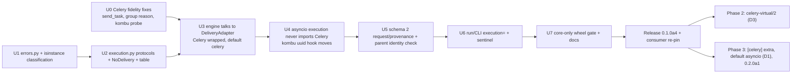

# Queue-independent core: implementation plan

Status: **plan only; nothing below is implemented.**

- Design: [specification](queue-independent-core.md)
- Decision record: [ADR 0002 (Proposed)](../adr/0002-queue-independent-core.md)
- Baseline: `main` at `57fa0fe`

Gate ids (V1…V13), coupling ids (C1…C23), gap ids (K1…K7) and decision ids
(D1…D8) all refer to the specification.

## Dependency order

Every unit below is a separate pull request that can be reviewed on its own.
The same rules apply to all of them:

- Each unit keeps the full existing suite, `check_package.py`,
  `check_examples.py`, `check_celery_contracts.py` (CI `confidence` job) and
  `check_mutations.py` green on ubuntu-latest and macos-latest.
- **Rollback:** revert the unit's merge commit. No unit mutates persisted data
  or published artifacts.
- **Mutation proof:** for every new gate, the author temporarily introduces the
  named bug, confirms the gate fails, and records the command and its output in
  the PR description. The mutant itself is not committed.

## Unit checklist

### U0: Celery fidelity fixes (independent; can ship as 0.1.0a3.post or within a4)

Files: `celery_driver.py`, `tests/test_celery_regressions.py`, `docs/contracts.md`.

- [ ] Patch `celery.app.base.Celery.send_task` in `VirtualCelery.install`. First decision: whether to *intercept* it (resolve `app.tasks[name]` and publish through the virtual path) or *reject* it with a sticky unsupported entry. Recommendation: reject in U0, and intercept later only if a consumer needs it. Restore the patch in `uninstall`.
- [ ] Make `group`/`chord` rejection name the primitive instead of saying "custom producers are not modelled" (P5).
- [ ] Probe K2, a direct `kombu.Producer.publish` on `memory://` under `execution="celery"`. If the probe confirms it is silently accepted, reject it the same way. If not, record the negative result in the spec.
- **Gates:** V5(d) and V5(e). The `send_task` test must assert `UNSUPPORTED` **and** that the task body never ran.
- **Mutation to prove:** remove the `send_task` patch. The scenario must go back to `PASS` and the gate must fail.
- **Compatibility risk:** a scenario that currently passes while calling `send_task` is a false pass, and it becomes `UNSUPPORTED`. That change is intended. Add it to the CHANGELOG under "Fixed".
- **Contract id:** this unit still belongs to `celery-virtual/1`. The contract id is introduced by U5, so no bump is needed.

### U1: shared error type

Files: new `errors.py`; `engine.py` (re-export `UnsupportedFeature`); `celery_driver.py` (`UnsupportedCeleryFeature(UnsupportedFeature)`); `_worker.py:76`.

- [ ] Classify errors with `isinstance(exc, (UnsupportedFeature, ClockRangeError))`. Keep the name-based fallback.
- **Gate:** existing unsupported tests, plus one test where a subclass raised inside a scenario is classified `UNSUPPORTED`.
- **Mutation to prove:** drop the `isinstance` branch *and* the fallback. The test must fail.
- **Risk:** none observable. `UnsupportedCeleryFeature` stays a `RuntimeError`.

### U2: protocol module (no behaviour change)

Files: new `execution.py` holding `Delivery`, `DeliveryAdapter`, `Settlement`, `Limits`, `CoreServices`, `ExecutionIdentity`, `Capability`, `NoDelivery`, `EXECUTIONS` and `FRAMEWORK_SENTINELS`. New `celery_contract.py`, pure data.

- [ ] Write capability and assumption content exactly as spec §11.1 lists it. Every capability row must cite the test that exercises it, or say "none".
- [ ] Add a unit test that `celery_contract.py` and `execution.py` import with `celery` blocked through `sys.modules['celery'] = None`.
- **Gate:** V2a static import scan, added here. At this stage it runs with an allow-list that still includes `engine.py`, and U4 removes that entry.
- **Risk:** none, because nothing uses the modules yet.

### U3: engine uses the seam; Celery wrapped; default `celery`

Files: `engine.py`, `celery_driver.py` (`CeleryExecution` adapter over `VirtualCelery`; `TaskRun` gains the `work_id`, `attempt`, `label` and `order_key` properties).

- [ ] Replace C2, C3, C6, C8–C16 with protocol calls. `WorkItem.run` keeps its name.
- [ ] Add the `Engine.celery` compatibility property. Make `engine.unsupported` core-owned, with the Celery list aliased to it.
- [ ] Map settlement: `Completed` goes to `finish(run)`. `Crashed` sets `run.state="CRASHED"` and then calls `finish(run)`. Keep the redeliver decision in the Celery adapter.
- [ ] Take `Limits` from the adapter. The soft exception comes from the adapter, which removes the lazy import at C12.
- [ ] Keep `arm_crash`. Its predicate receives the `Delivery`, which is still the `TaskRun`.
- [ ] Resolve K3: before touching settle, add a regression test with an inline multi-argument errback that calls `run_coro_sync` under `strict_lifecycle`. Record the result as-is, then decide whether to keep or fix it, and document the choice.
- [ ] Re-anchor the `forget-caught-unsupported` mutant to the core sink. All six mutant anchors must match exactly once.
- **Gates:**
  - V3 byte identity: capture `evidence_sha256` for the `celery_retry` example, the four simulated confidence cases and each `celery_adapter` mode at the **U0-merged commit** (U0 intentionally changes `send_task`/group behaviour, so `57fa0fe` is the wrong baseline for scenarios touching them), using seeds 0, 1 and 7. Store them in a *local* fixture file, generated by a local script that is not committed. Compare after the change.
  - V6 crash-ownership matrix for the `celery` execution.
  - V8 original payload on redelivery.
  - V9 mutations.
- **Mutations to prove:**
  - (a) Settle twice after a crash that follows return. V6 must fail.
  - (b) Skip `_cancel_limits`. The existing `keep-finished-task-deadlines` mutant must fail.
  - (c) Reuse the decoded args. `reuse-mutated-message` must fail.
- **Risks:**
  - R1: ledger or label drift. V3 detects it.
  - R2: the settle call site moves. It must stay inside the future's done callback, with the same `abandoned` short-circuit and the same `_cancel_limits` → settle → `_log_task` → `notify` order. That callback runs on the execution thread, or on the engine thread for a body that finished before registration.

### U4: `asyncio` execution; move the Kombu hook

Files: `engine.py` (import nothing from `celery_driver` at module level; `resolve()` imports it lazily only for `"celery"`), `celery_driver.py` (install gains the Kombu `uuid.__defaults__` hook, using `CoreServices.uuid4`), `execution.py` (`NoDelivery`).

- [ ] `Engine(execution="asyncio")` installs no framework hooks. `arm_crash` raises `UnsupportedFeature`. `engine.celery` raises `AttributeError`.
- [ ] Install order: the adapter becomes the last stage (R3). If V3 digests drift, keep the adapter at its original stage and pass `CoreServices.uuid4` lazily. Record which option was chosen.
- [ ] Remove `engine.py` from the V2a allow-list.
- **Gates:**
  - V2b runtime isolation: `sys.modules` and the identity of `Task.apply_async` after an `asyncio` run, in a venv where Celery is installed.
  - V2c: the stock asyncio comparison, run under both executions.
  - V6 for the `asyncio` execution: a crashed timeline execution is not redelivered, and a retained `to_thread` call is fenced.
  - V3 again.
- **Mutation to prove:** call `celery.install()` unconditionally. V2b must fail.
- **Risk:** R3, RNG order. V3 and V11 detect it.

### U5: schema 2, provenance and parent identity check

Files: `contracts.py` (`SCHEMA_VERSION = 2`; `validate_request` requires `execution`; `configuration()` includes it; `validate_result` compares `provenance.execution` with the parent-computed expectation, applies the asyncio consistency rules, and rejects schema 1), `provenance.py` (core deps plus the selected distributions), `runner.py` (compute identity and check distributions before spawn), `_worker.py` (pass the execution; emit identity and `framework_modules_loaded`).

- [ ] Missing distribution raises `RuntimeError` with an install hint. Unknown name raises `ValueError`.
- [ ] Celery version outside 5.6.x: the adapter install gives `UNSUPPORTED` (V5(h)). Test it by faking the version through a patched `importlib.metadata` in a unit test. Also test it through an installed wheel with a stub dist-info on the path. That fixture is built locally in `tmp` during the test and committed only as test code.
- **Gates:** V7 tamper suite, V10 stale and schema-1 rejection, V11 reproducibility.
- **Mutation to prove:** skip the identity comparison in `validate_result`. V7 must fail.
- **Compatibility risk (R5):** tooling that asserts `schema_version == 1` breaks. The consumer harness and `docs/validation` recorders must update.

### U6: public selection and sentinel

Files: `__init__.py`/`runner.py` (`run(..., execution=None)`), `cli.py` (`--execution {asyncio,celery}`), `_worker.py` (sentinel before evidence is frozen).

- [ ] The default is `DEFAULT_EXECUTION = "celery"`, so phase 1 behaviour is unchanged.
- **Gates:** V5(a) Celery scenario under `asyncio` gives `UNSUPPORTED`, with a reason naming the framework and the fix. V5(b), (c), (f) and (g). The CLI exit code for each is `3` or `4` as specified.
- **Mutations to prove:** disable the sentinel. V5(a) must fail (it would show P3's silent loss).
- **Risk:** K6, false positives from type-only imports. Document the remedy.

### U7: core-only wheel gate and documentation

Files: new `scripts/check_core_only.py`; CI `test` job step; `docs/adapters.md`, `docs/contracts.md`, `docs/architecture.md`, `README.md`, `CHANGELOG.md`; the support matrix in `docs/releases.md`.

- [ ] Build the wheel. Create a venv. Install the wheel with `--no-deps` and `time-machine` from `requirements-dev.lock` hashes. Assert `find_spec("celery") is None`. Run each asyncio example with `execution="asyncio"` and compare checks to the expected content. Assert that `execution="celery"` raises `RuntimeError` naming the extra.
- [ ] Add a `[celery]` extra that duplicates the hard dependency (a no-op alias), so documentation can recommend it early.
- **Gates:** V1 on ubuntu and macOS (V12).
- **Mutation to prove:** add a lazy `import kombu` in `provenance.py`. V1 must fail.

### Release 0.1.0a4

- [ ] Re-pin the consumer's kernel hashes. Run the consumer's full suite and historical proofs (V13). Historical proofs keep their own pinned wheels.
- [ ] Add a new `docs/validation/alpha4-release.json` recording V1–V13 results, commands and versions.
- **Acceptance (measurable):**
  - All V-gates pass on both operating systems.
  - V3 digests are equal for every captured case.
  - The consumer passes the same test count as `alpha2-consumer-full.json`, with the same before-fail/after-pass outcomes.
  - V2b shows zero framework modules under `asyncio`.
  - No `celery`, `kombu` or `billiard` import outside the allow-list.

### Phase 2: `celery-virtual/2` (needs D3)

- [ ] Derive redelivery after a crash from `task_acks_late` and `task_reject_on_worker_lost`, per the task or the app. If a scenario *requests* redelivery that the configuration would not provide, that is `not_configured` and gives `UNSUPPORTED` with the reason. An unrequested crash under the default configuration is modelled as a lost or acked message.
- [ ] Add a real-worker differential case with the default ack configuration (worker loss leads to no redelivery). Record it in `docs/validation`.
- [ ] Report unfired crash traps (D7/K4).
- **Risk:** some current consumer `PASS` results rely on request-only redelivery. List them before merge, from the consumer's run output.

### Phase 3: `0.2.0a1` (needs D1)

- [ ] `pyproject.toml`: `dependencies = ["time-machine>=3.5.1,<4"]` and `[celery] = ["celery>=5.6.3,<5.7"]`. Add `celery` to `[dev]`. Regenerate `requirements-dev.lock`.
- [ ] Set `DEFAULT_EXECUTION = "asyncio"` (D1).
- [ ] `check_package.py`/`check_examples.py`: run the Celery example only in a `[celery]` venv. V1 becomes a plain install.
- [ ] Update ADR 0002 to Accepted. Update the `docs/releases.md` dependency statement.
- **Rollback:** re-release with the dependency restored. Callers who pass `execution=` explicitly are unaffected either way, and the migration note tells everyone to pass it.

## Risk register

| ID | Risk | Likelihood | Detection | Mitigation |
|---|---|---|---|---|
| R1 | Celery ledger or evidence bytes drift | Medium | V3 digests | Adapter `ledger_record` returns the exact current tuple |
| R2 | Settle call site or order changes (done callback: `_cancel_limits` → settle → ledger → notify) | Medium | V3, V6, `crash_adapter` tests | Keep the call inside the same done callback |
| R3 | Install-order change shifts RNG consumption | Medium | V3, V11 | Fallback: keep the original stage |
| R4 | Sentinel false positives annoy users | Medium | User reports | Clear reason text; D5 later |
| R5 | Schema 2 breaks downstream tooling | High (by design) | Consumer V13 | CHANGELOG, migration note, consumer PR prepared alongside |
| R6 | A capability table that disagrees with code | Medium | Each row cites a test; review | A unit test asserts every `unsupported` option in `_UNSUPPORTED_OPTIONS` appears as a capability |
| R7 | K3 (inline errback lifecycle) surfaces during U3 | Low–medium | New regression test | Decide explicitly; document |
| R8 | Phase 3 default flip silently changes Celery users | Low with sentinel | V5(a) | Sentinel gives `UNSUPPORTED`, not loss |

## Unresolved decisions

| ID | Decision | Blocks |
|---|---|---|
| D1 | Phase 3 default (`asyncio`, `celery`, or required) | Phase 3 |
| D3 | Ack-configuration-derived redelivery | Phase 2 |
| U0 choice | Reject or intercept `send_task` | U0 (recommendation: reject) |
| D2, D4–D8 | See spec §20 | Nothing in phase 1 |

## Appendix: self-review (2026-09-29)

I read the three documents together and checked them against the source at `57fa0fe`.

**Contradictions I found and fixed**

- The spec said settle and inline errbacks run "on the execution's thread". In
  the source, `_done` is a `concurrent.futures` done callback. It runs on the
  engine thread when the body finished before the callback was registered. The
  spec's §9 and plan R2 now state both cases.
- V2b claimed the parent could check the patch identity of `Task.apply_async`
  after a run. It cannot, because the patch lives in the worker process. The
  check is now split into a worker `sys.modules` check and an in-process
  `Engine` check.
- The spec said the adapter records `settle` exceptions. Today the engine
  catches them. The spec now says the Celery adapter takes over that
  try/except, and settle must not raise.
- The V3 digest baseline was `57fa0fe`, but U0 intentionally changes behaviour.
  The baseline is now the commit where U0 was merged.
- The spec's asyncio example contained a tuple, which `json_value` rejects. It
  now uses lists and is marked as not executed.

**Lifecycle paths I checked**

The crash paths I checked are `at_start`, first-park, manual hard crash, soft
crash, hard and soft limits, crash after return, teardown, and a timeline crash.
Each is mapped in spec §10.4.

Four paths remain open, and each is tracked:

- Redeliveries enqueued at teardown never run, and the report doesn't show
  them (I6). This is documented, and behaviour is unchanged.
- An inline errback calling `run_coro_sync` under `strict_lifecycle` (K3). This
  is inferred and not probed. A regression test is required before U3.
- Unfired crash traps are silently ignored (K4, D7).
- Direct `kombu.Producer.publish` under `celery` (K2). This is unverified, and
  the probe is part of U0.

**Where the design is deliberately narrow**

- `DeliveryAdapter` is private, has two implementations, and uses a closed
  table.
- Transports are not abstracted.
- Direct-queue consumers are left to boundary fakes.
- The "validated" status is never emitted at runtime.
- The Dramatiq mapping is a paper exercise. It relies on a guide that does not
  state ack or crash semantics, and the spec says so.

**Checks run on the documents**

- All relative links resolve.
- All six Mermaid diagrams render with `@mermaid-js/mermaid-cli` (`mmdc`) and local Chrome. The render caught a `;` in a sequence-diagram message, which is now fixed.

**Evidence gaps**

- Probes P1–P5 were run on macOS only.
- Linux behaviour of the new gates is covered only by the plan, through CI.
- None of the V-gates exist yet.
- The capability table in spec §11.1 is derived from reading the code. Only
  some rows cite tests.
- The version values in the provenance example are illustrative.
- Citations were fetched on 2026-09-29 and may drift.
