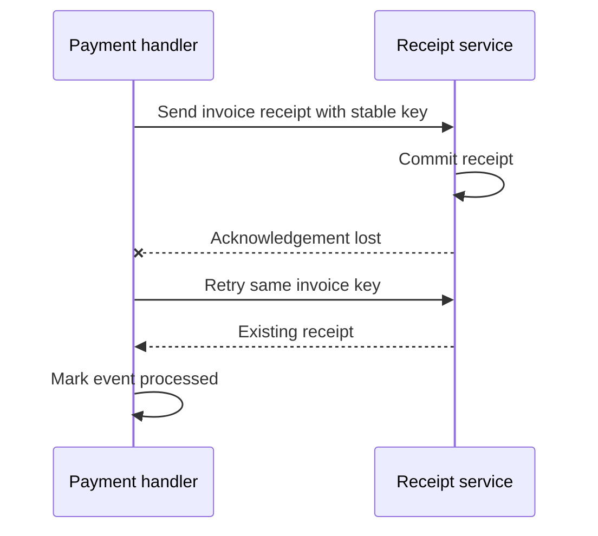
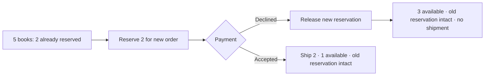
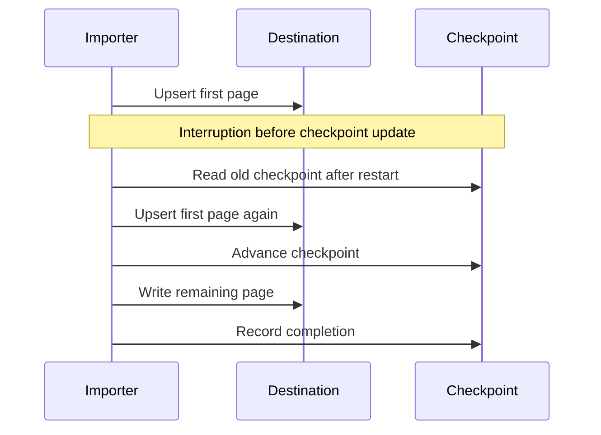
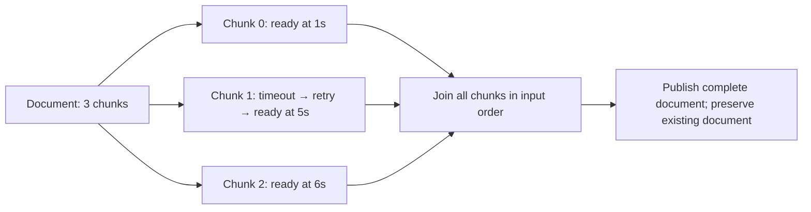
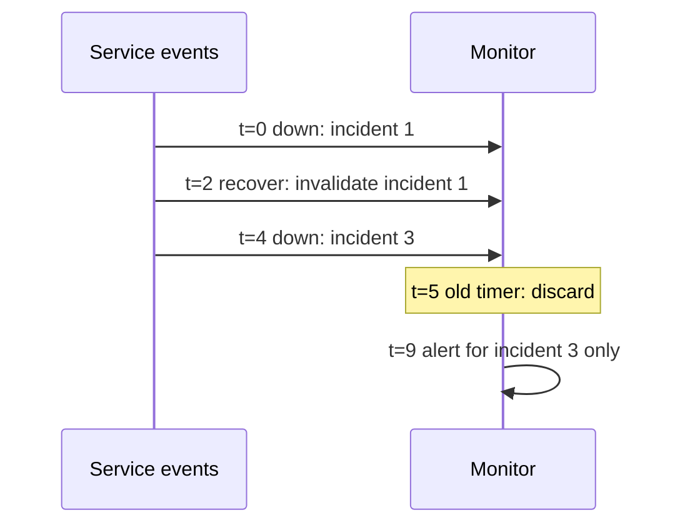
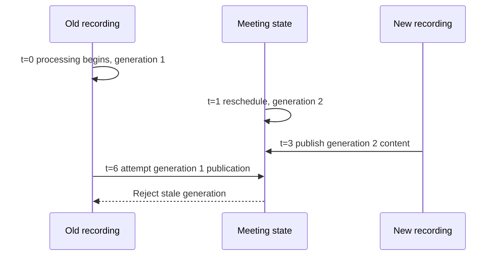

# Workflow examples

Six small reference applications show different failure patterns. They run the
application functions under virtual time, preserve existing state and check final
content. They are **synthetic reference workflows**, not claimed reproductions of
third-party production incidents. No credentials or live providers are needed.

Install the library, then run any adapter below. Each scenario's horizon is 12
virtual seconds. The same CLI produces the complete checks and causal ledger.

```sh
workflow-sim workflow_sim.examples.billing:build --duration 12 --output billing.json
printf '{"broken":true}\n' > broken.json
workflow-sim workflow_sim.examples.billing:build --duration 12 --inputs broken.json --output billing-broken.json
```

The corrected example returns PASS / exit 0. The deliberate bug returns
ASSERTION_FAILED / exit 1. An unsupported operation or harness failure is not an
acceptable substitute for the intended business assertion failure.

| Domain / adapter | Injected situation | Observable invariant |
| --- | --- | --- |
| `billing` | Receipt commits, response is lost, webhook arrives twice | Paid account, one exact receipt, completed processing marker |
| `fulfillment` | Payment declines after stock reservation | Release only this order's stock; preserve the older reservation; no shipment |
| `ingestion` | Import interrupted between row writes and checkpoint | Correct replacement content, no duplicate/missing rows, completion after recovery |
| `documents` | One extraction retries; another finishes late | All chunks in original order before document publication |
| `monitoring` | Recovery and a new outage happen during an alert delay | Only the current incident sends its delayed alert |
| `meetings` | New recording finishes before a stale recording | New occurrence content survives; previous meeting remains intact |

## Billing: lost acknowledgement



Run `workflow_sim.examples.billing:build`. The account starts on a trial plan.
A receipt commits before a timeout, then the webhook is delivered again. The bug
uses a different idempotency key on each attempt, creating a second receipt.
The checks inspect receipt content and count, account state, attempts and markers.

Fixture provenance: the minimal `invoice.paid` envelope and invoice fields follow
[Stripe's webhook documentation](https://docs.stripe.com/webhooks) and
[invoice object](https://docs.stripe.com/api/invoices/object). IDs and values are
invented. The receipt service's atomic idempotency contract is our explicit model;
this example does not test Stripe signatures, transport or account provisioning APIs.

## Fulfillment: compensate a reservation



Run `workflow_sim.examples.fulfillment:build`. Broken mode omits compensation.
Use inputs `{"decline":false}` to exercise successful payment and shipment.
The scenario checks both the requested effect and preservation of another order.
Inventory, payment and shipping interfaces are synthetic; atomic reservation is a
boundary assumption. Real database isolation and payment settlement need separate
integration tests. A decline is modeled as definitive, not an ambiguous timeout.

## Data ingestion: restart from the last durable checkpoint



Run `workflow_sim.examples.ingestion:build`. The destination already has stale
content and an unrelated row. Broken mode appends instead of replacing by ID.
Checks inspect every resulting row, checkpoint and completion status. The fault is
an exception at a persistence boundary; it is not a process kill. The source pages
and upsert contract are synthetic. Worker-loss redelivery is tested separately by
the real Celery confidence checks.

## Document / AI processing: fan-out and join



Run `workflow_sim.examples.documents:build`. Broken mode publishes after the first
completed chunk. Other tasks eventually finish, but cannot repair the incomplete
published content. Checks examine assembled text, which chunks were ready at
publication and the per-chunk attempt counts. Text responses are fixed synthetic
fixtures: this tests orchestration, not OCR accuracy, LLM answer quality or billing.

## Monitoring: stale alert after recovery



Run `workflow_sim.examples.monitoring:build`. Broken mode checks only whether the
service is currently down; it forgets to check the incident generation. The old
alert then fires during the new outage. The model uses synthetic service events
and records notifications locally; actual notification-provider delivery is outside
this example.

## Meetings: fence stale work



Run `workflow_sim.examples.meetings:build`. Broken mode lets the late result
replace the new occurrence's content. The checks also preserve an earlier meeting.
This is a synthetic reduction of the generation-fencing pattern in the private
meeting integration, not a Google/Microsoft/recording-provider integration test.

## Reusing the examples

Each module separates the workflow function from `build(ctx)`. Replace the example
ports with your boundary adapters, keep application logic real, and replace the
assertions with your actual business contract. Run provider contract tests against
real services or documented captured fixtures before trusting a substitute.

For contributors, `python scripts/check_examples.py --output results/examples`
runs all 12 fixed/broken cases and writes full evidence plus a summary. CI runs it
against the installed wheel. Keep known broken cases: a demonstration that only
passes is insufficient evidence that its assertions can detect the intended bug.
