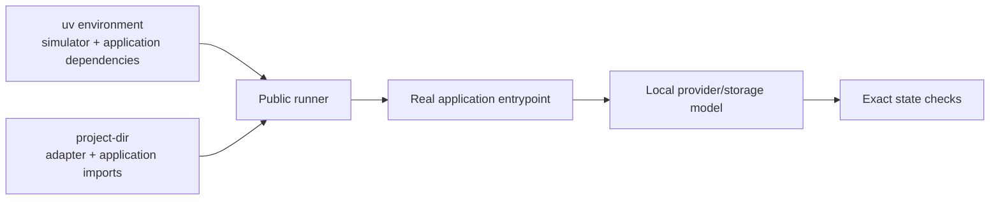

# Use workflow-sim in an existing project

Start with one application entrypoint and one failure. Keep its decision logic
running; replace the database, provider or other external boundary it calls.
You do not need to package the application just to import it in a simulation.

## Choose an environment

For an existing uv project whose Python range fits `>=3.12,<3.13`, run from its root:

```sh
uv add --dev 'workflow-sim @ git+ssh://git@github.com/karthiksraju/workflow-sim.git@v0.1.0a4'
```

Keep the dependency and `uv.lock` together. If the application supports other
Python versions or uses a different dependency manager, create a separate trial
project instead of changing its production requirements:

```sh
uv init --bare --python '>=3.12,<3.13' workflow-trial
cd workflow-trial
uv add 'workflow-sim @ git+ssh://git@github.com/karthiksraju/workflow-sim.git@v0.1.0a4'
```

Install the dependencies needed by the application path you will import into
this trial environment. Source lookup does not install dependencies. Use a
disposable checkout without production credentials or `.env` files; importing
an application's settings can itself load credentials or open connections.

## Connect the application

Put `sim_adapter.py` beside the application's importable package. For a `src/`
layout, put it under `src/` and use that directory as `--project-dir`, or install
the application into the trial environment and use the adapter's directory.



This template assumes your application exposes
`refresh(document_id, provider, documents)` and its own `ProviderUnavailable`
exception. Replace those names and the boundary model with your actual contract.
The modeled provider fails before returning new content. The old publication and
an unrelated document must survive, and the failure must reach the caller.

```python
from app.jobs import ProviderUnavailable, refresh


class UnavailableProvider:
    async def fetch(self, document_id):
        raise ProviderUnavailable("temporary outage")


def build(ctx):
    documents = {"doc-42": "previous complete version", "other": "keep"}
    observed = {"failure": None}

    async def attempt():
        try:
            await refresh("doc-42", UnavailableProvider(), documents)
        except ProviderUnavailable:
            observed["failure"] = "provider unavailable"

    # Register checks during setup, before the scheduled callback runs.
    ctx.expect("stored documents", lambda: documents,
               {"doc-42": "previous complete version", "other": "keep"})
    ctx.expect("failure reaches caller", lambda: observed["failure"],
               "provider unavailable")
    ctx.at(0, "refresh document", attempt)
```

Catch only the error the scenario expects. Let unexpected exceptions surface.
For applications using module-level clients, replace those client bindings before
calling the entrypoint. Keep internal selectors, retry decisions and write-order
logic real. Document the schema or producer code behind each boundary model.

For a Celery task, schedule `task.delay(...)` or `task.apply_async(...)` inside
`ctx.at`; calling its function body alone does not exercise task delivery/retry.
See the [Celery example](../src/workflow_sim/examples/celery_retry.py).

## Run against the checkout

From the environment where workflow-sim and the required dependencies are installed:

```sh
uv run workflow-sim sim_adapter:build \
  --project-dir /absolute/path/to/application \
  --duration 10 --output result.json
```

`--project-dir` controls imports. The worker runs in a temporary current directory;
read fixtures with `ctx.project_dir / "fixtures" / "case.json"`, not a relative
path. Use `ctx.scratch_dir` for disposable output. `PYTHONPATH` is ignored.
The Python API accepts the same directory as `run(..., project_dir=...)`.

## Check that the evidence proves the failure

Temporarily introduce the suspected application bug in the disposable checkout.
For this template, swallowing `ProviderUnavailable` should produce
`ASSERTION_FAILED` on "failure reaches caller". Restore the application and rerun
the identical adapter: it should return `PASS`. Then add a successful retry and
check the exact replacement content and absence of duplicate publication.

| Result or symptom | What to do |
| --- | --- |
| `ASSERTION_FAILED` | Inspect `evidence.checks`: compare each `actual` with `expected`. |
| `HARNESS_ERROR` | Inspect `error` and `evidence.report` callback/task failures. An exception escaping the adapter is not a business-assertion negative control. |
| `ModuleNotFoundError` | Verify the module name, `--project-dir` and installed dependencies. A bare project does not by itself require packaging. |
| Non-JSON value | Project tuples, datetimes, sets or model objects into lists, strings and JSON objects before returning them from a check. |
| `INCOMPLETE` or `UNSUPPORTED` | Inspect outstanding work, budgets or unsupported operations; do not count these as proof that a business check caught the bug. |

Use `ctx.expect` for expected business failures. A plain `assert` inside a
scheduled callback raises an execution error and produces `HARNESS_ERROR`.
Final-state getters run after the horizon; pass a callable rather than a value.

Save separate before/after outputs with the application revision, fixture identity,
command and library version. The adapter hash does not cover imported application
files. A `PASS` validates this execution and its models; live external contracts
still need integration checks. [Full result and timing contracts](contracts.md).
