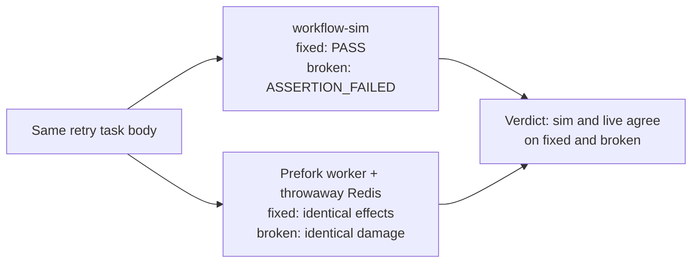

# Live-cert pilot scope (Phase 0)

Pilot the dual-execution procedure on two properties before claiming anything live.

## Property 1: Celery retry payload

Celery countdown retry preserves its JSON payload and leaves older deliveries
intact. Grounded in `src/workflow_sim/examples/celery_retry.py`: the retry path
uses the real Celery producer/tracer; only the store is synthetic.

- Checks: `delivered content` (exact list, old entry first) and `retry lineage`
  (`[0, 1]`).
- Broken control: mutating the payload before `self.retry()` must fail
  `delivered content` while `retry lineage` still matches.

## Property 2: billing webhook idempotency

Payment webhook provisioning commits exactly one receipt despite a lost
acknowledgement and a duplicate webhook. This is an asyncio comparison over a
modeled boundary: both sides run the real `provision()` against the same
synthetic in-memory `Account` (`src/workflow_sim/examples/billing.py`; event
fields follow Stripe's documented `invoice.paid` envelope, values synthetic).
The live side compares final modeled state — it does not verify durable
receipt commits or receiver idempotency, which remain modeled (SQLite grounding
is a separate workstream).

- Checks: `paid account`, `one exact receipt`, `acknowledgement retried`
  (attempts `2`), `completion recorded after delivery`.
- Broken control: a per-attempt idempotency key must fail `one exact receipt`
  (two duplicate receipts) while the other three checks still match.

## Procedure (per property)

1. Sim run: fixed inputs → `PASS`, no pending items or violations.
2. Same code against a live counterpart with equivalent assertions:
   - Celery properties: real prefork worker + throwaway Redis (unique queue,
     no flush of shared state) → same durable effects as the sim.
   - Asyncio properties: the real coroutine under ordinary asyncio with
     wall-clock sleeps → same final modeled state as the sim's checks.
   The live harness reports per-check agreement (not a bare boolean) and the
   broken variant must fail the same check live as in the sim.
3. Broken control: equivalent assertions reject the broken variant in both
   the sim and the live counterpart.

All three are required. Sim-only PASS is not certification.

## Environment pins (recorded per run)

Celery 5.6.3, kombu 5.6.2, JSON serializer, prefork pool, concurrency 1,
throwaway Redis 8.10.2 (locally built; differs from CI's recorded version),
CPython 3.12, Linux. Sim adapter `source_sha256 2963cc8a…`
(`workflow_sim.examples.celery_retry` at this revision).

## First-property run (2026-10-02, branch `live-cert/dual-execution-scope`)

- Sim fixed → `PASS` (exit 0): exact delivered list, lineage `[0, 1]`.
- Sim broken → `ASSERTION_FAILED` (exit 1): `items: []` vs `['book']`.
- Live fixed → identical durable effects and attempts `[0, 1]`.
- Live broken → identical damaged payload live, so the correct expectation
  fails live too. The negative control holds on both sides.

Raw results and the pilot-specific harness stay outside the tree (thread
storage, not committed). The repeatable gate for the pilot properties is
`scripts/check_live_cert.py` (sim + CLI exit codes always; prefork leg when
`LIVE_CERT_BROKER` is set). The permanent in-repo gate for prefork-vs-sim
agreement remains `scripts/check_celery_contracts.py`; see
[confidence](confidence.md).

## Second-property run (2026-10-05, branch `live-cert/billing-dual-execution`)

The live side runs the real `provision()` under ordinary asyncio with
wall-clock sleeps (~2 s) against the same synthetic `Account`, reporting
per-check agreement and exiting nonzero on any mismatch (fixed) or on a
missing duplicate manifestation (broken).

- Sim fixed → `PASS` (exit 0): all four checks match.
- Sim broken → `ASSERTION_FAILED` (exit 1): only `one exact receipt` fails.
- Live fixed → one exact receipt, attempts `2`, plan `paid`,
  processed `['evt-paid-42']`: matches the sim expectation.
- Live broken → two duplicate receipts with attempts `2`: the bug manifests
  live exactly as in the sim, so the correct expectation fails live too.

## Non-claims

One controlled schedule per property; no RabbitMQ, database, provider, or
thread-ordering claims. Seed and timing bounds from `docs/contracts.md` still apply. Live result
certifies the recorded stack and task revision only.
