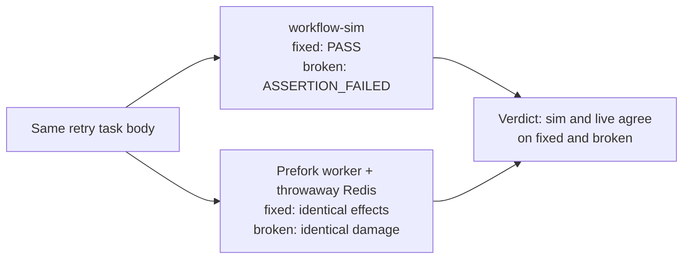

# Live-cert pilot scope (Phase 0)

Pilot the dual-execution procedure on one property before claiming anything live.

## Property

Celery countdown retry preserves its JSON payload and leaves older deliveries
intact. Grounded in `src/workflow_sim/examples/celery_retry.py`: the retry path
uses the real Celery producer/tracer; only the store is synthetic.

- Checks: `delivered content` (exact list, old entry first) and `retry lineage`
  (`[0, 1]`).
- Broken control: mutating the payload before `self.retry()` must fail
  `delivered content` while `retry lineage` still matches.

## Procedure (per property)

1. Sim run: fixed inputs → `PASS`, no pending items or violations.
2. Same task body against an ephemeral live stack (real prefork worker +
   throwaway Redis, unique queue, no flush of shared state) → same durable
   effects as the sim.
3. Broken control: same assertions reject the mutated-payload variant in both
   the sim and the live stack.

All three are required. Sim-only PASS is not certification.

## Environment pins (recorded per run)

Celery 5.6.3, kombu 5.6.2, JSON serializer, prefork pool, concurrency 1,
throwaway Redis 8.10.2 (locally built; differs from CI's recorded version),
CPython 3.12, Linux. Sim adapter `source_sha256 2963cc8a…`
(`workflow_sim.examples.celery_retry` at this revision).

## Pilot run (2026-10-02, branch `live-cert/dual-execution-scope`)

- Sim fixed → `PASS` (exit 0): exact delivered list, lineage `[0, 1]`.
- Sim broken → `ASSERTION_FAILED` (exit 1): `items: []` vs `['book']`.
- Live fixed → identical durable effects and attempts `[0, 1]`.
- Live broken → identical damaged payload live, so the correct expectation
  fails live too. The negative control holds on both sides.

Raw results and the pilot-specific harness stay outside the tree (thread
storage, not committed). The permanent in-repo gate for prefork-vs-sim
agreement remains `scripts/check_celery_contracts.py`; see
[confidence](confidence.md).

## Non-claims

One controlled schedule only; no RabbitMQ, database, provider, or thread-ordering
claims. Seed and timing bounds from `docs/contracts.md` still apply. Live result
certifies the recorded stack and task revision only.
