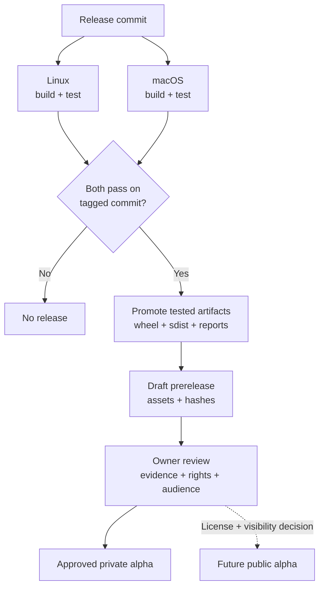

# Maintaining and releasing the alpha

Karthik (@karthiksraju) owns triage, compatibility and release approval. Use GitHub
issues for sanitized bugs and extension requests. Prioritize false PASS reports,
containment failures and installation failures; then model/adapter gaps. Reproduce
first and attach a negative control to the fix.

## The artifact that was tested is the artifact released

The draft workflow promotes CI artifacts instead of rebuilding another wheel.
No PyPI publisher is enabled. The public-alpha step is a future owner decision.

## Release checklist

1. Update the version in pyproject.toml and `workflow_sim.__version__`, CHANGELOG,
   release notes, supported-runtime matrix and migration notes. Do not reuse a tag.
2. Run CI on the release commit: installed-wheel conformance on Linux and macOS,
   strict package metadata, and examples in a minimal fresh environment. CI uploads
   wheel, sdist and test results with 30-day retention.
3. Run the meeting consumer upgrade comparison against its pinned application
   revision. Preserve known failing product cases and failure identities. Record
   wheel hash and both application/library revisions with the comparison.
4. Commit/push, then create and push `v<version>` at that exact commit.
5. Dispatch **Draft alpha release** with that tag. It requires successful platform
   CI on the same commit and both named platform jobs, promotes the exact tested
   Linux distribution artifact, and creates a draft GitHub prerelease
   containing wheel, sdist, platform test reports and SHA256SUMS. It does not publish to PyPI.
6. Review artifact hashes, notes, visibility and distribution rights. For an
   approved private alpha, share repository access with named testers. For a
   public alpha, first settle ownership/license, add LICENSE and matching metadata,
   enable private vulnerability reporting, then choose public visibility.

The repository is currently private and the metadata contains `Private :: Do Not
Upload`, which blocks accidental PyPI uploads. Remove that marker only after the
public-distribution decision. Before PyPI publication, verify the distribution name
is available and configure a dedicated environment and Trusted Publisher; never
store a long-lived PyPI token in this repository.

Packaging follows [PyPA's pyproject guidance](https://packaging.python.org/en/latest/guides/writing-pyproject-toml/).
A future PyPI workflow should use [PyPI Trusted Publishing](https://docs.pypi.org/trusted-publishers/using-a-publisher/).

## Compatibility and dependency changes

Support only CPython 3.12 and the two tested OS families for this alpha. Add a
runtime only after clock boundary, crash-return, pool ownership and process cleanup
probes pass there. These tests exercise CPython internals, so installing successfully
is insufficient. Celery is an explicit dependency until a second real backend
justifies a separate backend contract.

Weekly dependency update PRs are configured. Regenerate/review the hash lock and
run the same release checks. Record schema changes separately from package version.
A fix that changes evidence intentionally must include migration guidance for
stored records. Retain old tagged source and assets so previous evidence remains
reproducible.

## Tester intake

Ask for workflow type, Python/OS, external boundaries, the bug they expected to
catch, setup friction and any surprising verdict. Request a small sanitized
adapter, seed and provenance rather than a production data dump. Track missing
contracts separately from runtime defects. Measure successful installation,
first useful assertion, reproducible negative control and false verdict reports;
a raw scenario count is not a confidence metric.

The first external callout should state the support matrix, alpha status, trusted
adapter requirement and known limits. Do not advertise proof of production safety
or full distributed-system simulation.

## Current repository enforcement

Issues, CODEOWNERS, dependency update PRs, vulnerability alerts and automatic
merged-branch deletion are enabled. CI and the release verifier enforce the
release checks. GitHub rejected branch-protection setup with HTTP 403 because
this personal account's current plan does not support it on private repositories.
Until the repository is public or the plan changes, owners must check CI before
merging; CODEOWNERS and the PR template are review guidance, not server-enforced
merge protection. No plan upgrade or public visibility change was made.
