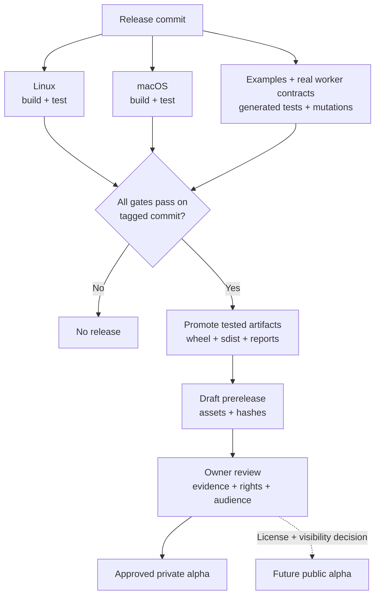

# Maintaining and releasing the alpha

@karthiksraju owns triage, compatibility and release approval. Prioritize false
PASS reports, containment failures and installation failures, then adapter gaps.
Reproduce the bug and show that the regression check detects it.

## The artifact that was tested is the artifact released

Promote the artifacts tested by CI. The workflow creates a private draft;
publication requires owner approval. No PyPI publisher is enabled.

## Release checklist

1. Update the version in pyproject.toml and `workflow_sim.__version__`, CHANGELOG,
   release notes, supported-runtime matrix and migration notes. Do not reuse a tag.
2. Run CI on the release commit: installed-wheel conformance on Linux and macOS,
   strict package metadata, and examples in a minimal fresh environment. CI uploads
   wheel, sdist and test results with 30-day retention.
3. For runtime changes, compare the meeting consumer at its pinned application
   revision. Preserve known product failures and assertion identities. Record the
   wheel hash and application/library revisions.
4. Commit/push, then create and push `v<version>` at that exact commit.
5. Dispatch **Draft alpha release** with that tag. Both platform jobs and the
   confidence job must pass on the tagged commit. The workflow promotes the tested
   Linux wheel/sdist, platform reports, example/confidence archives and SHA256SUMS
   into a draft GitHub prerelease.
6. Review artifact hashes, notes, visibility and distribution rights. For an
   approved private alpha, share repository access with named testers. For a
   public alpha, first settle ownership/license, add LICENSE and matching metadata,
   enable private vulnerability reporting, then choose public visibility.

Keep `Private :: Do Not Upload` in package metadata until public distribution is
approved; it blocks accidental PyPI uploads. Before PyPI publication, verify the
distribution name is available and configure an environment and Trusted Publisher; never
store a long-lived PyPI token in this repository.

Packaging follows [PyPA's pyproject guidance](https://packaging.python.org/en/latest/guides/writing-pyproject-toml/).
A future PyPI workflow should use [PyPI Trusted Publishing](https://docs.pypi.org/trusted-publishers/using-a-publisher/).

## Compatibility and dependency changes

Support only CPython 3.12 and the two tested OS families for this alpha. Add a
runtime only after clock boundary, crash-return, pool ownership and process cleanup
probes pass there. These tests exercise CPython internals, so installing successfully
is insufficient. Celery is an explicit dependency until a second real backend
justifies a separate backend contract.

Weekly dependency update PRs are configured. Regenerate/review the hash lock and
run the same release checks. Record schema changes separately from package version.
A fix that changes evidence intentionally must include migration guidance for
stored records. Retain old tagged source and assets so previous evidence remains
reproducible.

## Tester intake

Use the [feedback form](https://github.com/karthiksraju/workflow-sim/issues/new?template=alpha-feedback.yml)
for workflow type, environment, setup friction and surprising verdicts. Ask for a
small sanitized adapter and its provenance. Track missing boundary contracts
separately from runtime defects.

A useful trial ends with a real workflow assertion that catches the intended bug.
Launch claims should state the support matrix, trusted-adapter requirement and
model limits; see the [draft copy](launch-post.md).

## Current repository enforcement

CI and the release verifier enforce artifact promotion checks. Branch-protection
setup was rejected with HTTP 403 under the personal account's private-repository
plan. Until protection is configured, check CI before merging: CODEOWNERS and the
PR template alone do not prevent an unchecked merge.

For an examples/docs-only release, compare every runtime module byte-for-byte
against the prior consumer pin, then verify the new wheel identity and focused
consumer loader/replay tests. Record that narrower scope explicitly; do not call
it a new full application validation. See [confidence recipes](confidence.md).
