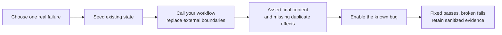

# Try the alpha with your workflow

Already have an application? Start with the [existing-project setup](existing-project.md)
for environments, imports and a failure adapter.

Use uv on Linux or macOS to create a project with CPython 3.12.
Follow the [public HTTPS installation steps](../README.md#try-the-installed-package);
GitHub credentials are not required. Choose a [domain example](examples.md) close to
your workflow and run both its corrected and `broken` versions.

1. Pick a failure: lost acknowledgement, retry after a partial write, stale
   completion, or unfinished child task. Write down the state that should survive.
2. Call your application through an [adapter](adapters.md). Model its external
   services and storage; keep the decision logic you want to test running.
3. Seed old state, including completed markers or interrupted attempts. Assert
   exact final content, preserved unrelated data and absence of duplicate effects.
4. Introduce the bug. Check that it fails the intended assertion. A timeout or
   crashed adapter does not demonstrate that the business assertion works.
5. Retain the command, inputs, seed, clock origin, horizon, version and sanitized
   result. Check the modeled external contracts against a real integration.

For date-sensitive workflows, pass `start_at="2026-01-15T10:00:00Z"` to `run`,
or `--start-at 2026-01-15T10:00:00Z` to `uv run workflow-sim`. An explicit timezone is required.
The default origin is 2099-01-01 UTC. See [contracts](contracts.md).

For AI workflows, controlled outputs let you test retries and publication. Model
answer quality needs a separate evaluation. Billing results depend on whether
your provider and storage actually honor the modeled delivery/idempotency rules.

Share setup friction and unexpected results through the
[feedback form](https://github.com/karthiksraju/workflow-sim/issues/new?template=alpha-feedback.yml).
Use the [bug form](https://github.com/karthiksraju/workflow-sim/issues/new?template=bug.yml)
for a false PASS or runtime error. Include a small reproduction and remove
credentials, customer content and private paths. The library uploads no telemetry.
