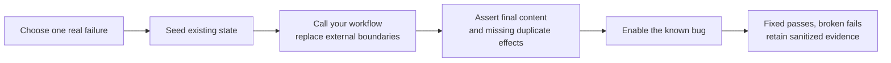

# Try the alpha with your workflow

Start with CPython 3.12 on Linux or macOS and an isolated development environment.
Installation currently requires access to the private repository. Follow the
[README installation](../README.md#try-the-installed-package), then choose a
[domain example](examples.md) close to your workflow.

1. Run the example once, then run its `broken` variant. Read the differing
   `actual`/`expected` values, not only the outcome label.
2. Pick one failure you recognize: a lost acknowledgement, retry after a partial
   write, stale completion, or unfinished child task. Record what should remain
   true after it happens.
3. Call your actual application function from an adapter. Replace network,
   storage and clock boundaries as needed; avoid replacing internal business logic.
   Use [adapter authoring](adapters.md) for supported scheduling and assertions.
4. Seed realistic old state, including prior completion markers or an interrupted
   attempt. Assert exact resulting content and preservation of unrelated data.
5. Reproduce the plausible bug and verify it fails the intended assertion. A
   timeout, unsupported operation or crashed adapter is not that business check.
6. Retain the command, inputs, seed, horizon, library version and sanitized result.
   Compare the modeled external contracts with a real integration test.

For AI workflows, test retries, orchestration, completion and publication with
controlled outputs. Use a separate evaluation dataset to assess model quality.
For billing workflows, reconcile the modeled idempotency and delivery rules with
your provider and storage implementation before drawing production conclusions.

Use the [alpha feedback form](https://github.com/karthiksraju/workflow-sim/issues/new?template=alpha-feedback.yml)
to tell us your category, time to first useful assertion, boundary work, broken
control and any surprising verdict. For a false PASS or runtime error, use the
[bug form](https://github.com/karthiksraju/workflow-sim/issues/new?template=bug.yml).
Remove credentials, customer content and private paths. No telemetry is uploaded.

An initial alpha success means you installed it, connected one real workflow,
produced a meaningful failure, fixed it, and reproduced the result. We want to
learn which boundary contracts and execution features made that difficult.
