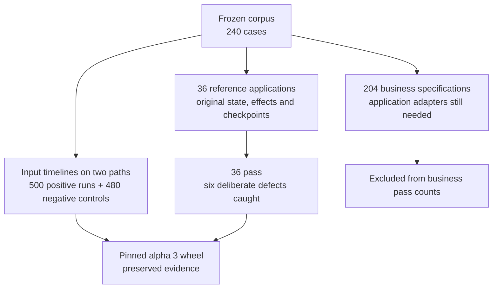

# Independent corpus evaluation — existing alpha 3

The frozen independently authored corpus has **240 cases, 40 per domain**. It
contains workflow requirements and concrete data, not executable applications.
The existing alpha 3 wheel was tested without changes. No new runtime defect was
observed in the executed scope; this does **not** establish 240 business passes.

| Domain | Corpus timelines exercised with asyncio and Celery | Reference business cases passing | Business cases needing adapters |
| --- | ---: | ---: | ---: |
| Billing | 40 | 6 | 34 |
| Fulfillment | 40 | 6 | 34 |
| Ingestion | 40 | 6 | 34 |
| AI/documents | 40 | 6 | 34 |
| Monitoring | 40 | 6 | 34 |
| Meetings | 40 | 6 | 34 |
| **Total** | **240** | **36** | **204** |

## Executed checks

- 480 positive runtime runs: each timeline's exact relative delivery times,
  identities, causal prerequisites and complete payloads on both asyncio and
  Celery JSON paths.
- 20 additional positive runs: another legal equal-time order for ten timelines
  on both paths. This is not exhaustive schedule or business-branch exploration.
- 480 corrupted-payload controls: each fails solely on the injected corruption;
  timing and causal checks remain correct.
- 36 reference business cases: independently implemented state transitions receive
  initial records and events, never expected values or case IDs. Observation code
  compares original corpus projections, effect multisets/order, unrelated-record
  preservation and checkpoints. Six deliberately broken variants are caught.
- Four probes: one-microsecond lateness is detected; outstanding work and
  unobserved child errors remain non-PASS despite matching business values; the
  requested corpus clock origin differs from the public runner's fixed epoch.

**1,026 final simulator executions** used CPython 3.12 on macOS. This evaluation
was not rerun on Linux; earlier release CI remains separate evidence. The
[per-case index](corpus-alpha3.json) records coverage, versions, source identity,
hashes and limitations. Raw results and the reproduction harness are retained
locally as an evidence archive; its SHA256 is recorded in the index. No evaluation
harness code was added to the library or a PR.

## Findings and limits

The public alpha API fixes its clock at **2099-01-01 UTC**, while the corpus asks
for 2026 origins. Relative schedules work; date-sensitive behavior that consults
the current clock needs an explicit application clock binding or a configurable
origin. Original calendar payloads were retained. Absolute-calendar correctness
was not established by shifting their dates.

The initial bridge compared measured float seconds with integer fixture seconds.
Alpha 3's exact-JSON contract distinguishes `1.0` and `1`, so all 500 positive
probes initially failed on representation. Final probes use exact integer
microseconds; a one-microsecond error still fails. The original results remain
archived. No monetary value or corpus expectation was rounded or modified.

The 204 cases without domain adapters are not runtime failures or `UNSUPPORTED`
results. All ten branching-outcome business cases remain in this group. Their
external worlds and full transitions must be implemented before comparing the
business oracles. Passing a generic event-delivery probe is insufficient.

Reference applications consume supplied boundary facts. They do not validate live
providers, autonomous retries, real worker crashes or database durability. The
commerce crash is a boundary notification, and monitoring acceptance events drive
receiver effects; no OS process or real pager is exercised here. Natural-language
fault annotations are not automatically executable failure injection.

The fast native reference uses ordinary asyncio with logical event time to help
separate an application/oracle mismatch from simulator behavior. It is not a
real-time or external-service differential test. Independent expected outcomes
were preserved rather than weakened to fit the alpha.

Next: configurable origin with date/DST regression controls, explicit adapters
for branching external outcomes, and additional domain coverage through actual
adopter workflows. Neither the released wheel nor frozen corpus was changed.
